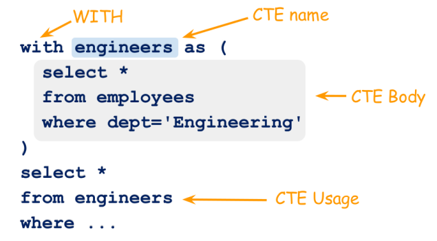

# CTE와 Recursive CTE

이번 시간에는 계층형 쿼리를 만들 수 있는 Recursive CTE에 대해 알아보겠습니다.

그 전에 Recursive CTE의 기반이 되는 CTE에 대해 먼저 알아보겠습니다.

## CTE란?

- CTE란 Common Table Expression의 약자로 **공통 테이블 식**이라고 하며, ANSI-SQL99에서 나온 개념입니다.
- SELECT, INSERT, UPDATE, DELETE문에서 참조할 수 있는 **임시 결과 집합**입니다.
- VIEW 처럼 개체로 저장되지 않고 **쿼리 지속시간**에만 존재합니다.
- **Recursive(재귀**)를 사용할 수 있습니다.

## CTE 문법

CTE는 ``WITH 테이블명 AS (SELECT ...)`` 구문을 사용해서 정의합니다.

아래 그림을 보면 e**nginners라는 CTE를 생성해서 아래 SELECT 구문에서 CTE의 내용을 사용**하고 있는 것을 알 수 있습니다.



## CTE 예제

Oracle도 CTE를 지원하기 때문에 Oracle를 사용해서 예제를 작성하겠습니다.

예제에 사용할 테이블과 데이터는 아래와 같습니다.

```
create table EMP
(
    EMPNO    NUMBER(4),
    ENAME    VARCHAR2(10),
    JOB      VARCHAR2(9),
    MGR      NUMBER(4),
    HIREDATE DATE,
    SAL      NUMBER(7, 2),
    COMM     NUMBER(7, 2),
    DEPTNO   NUMBER(2)
);

INSERT INTO EMP (EMPNO, ENAME, JOB, MGR, HIREDATE, SAL, COMM, DEPTNO) VALUES (7788, 'SCOTT', 'ANALYST', 7566, TO_DATE('1982-12-09 00:00:00', 'YYYY-MM-DD HH24:MI:SS'), 3000.00, null, 20);
INSERT INTO EMP (EMPNO, ENAME, JOB, MGR, HIREDATE, SAL, COMM, DEPTNO) VALUES (7902, 'FORD', 'ANALYST', 7566, TO_DATE('1981-12-03 00:00:00', 'YYYY-MM-DD HH24:MI:SS'), 3000.00, null, 20);
INSERT INTO EMP (EMPNO, ENAME, JOB, MGR, HIREDATE, SAL, COMM, DEPTNO) VALUES (7499, 'ALLEN', 'SALESMAN', 7698, TO_DATE('1981-02-20 00:00:00', 'YYYY-MM-DD HH24:MI:SS'), 1600.00, 300.00, 30);
INSERT INTO EMP (EMPNO, ENAME, JOB, MGR, HIREDATE, SAL, COMM, DEPTNO) VALUES (7900, 'JAMES', 'CLERK', 7698, TO_DATE('1981-12-03 00:00:00', 'YYYY-MM-DD HH24:MI:SS'), 950.00, null, 30);
INSERT INTO EMP (EMPNO, ENAME, JOB, MGR, HIREDATE, SAL, COMM, DEPTNO) VALUES (7844, 'TURNER', 'SALESMAN', 7698, TO_DATE('1981-09-08 00:00:00', 'YYYY-MM-DD HH24:MI:SS'), 1500.00, null, 30);
INSERT INTO EMP (EMPNO, ENAME, JOB, MGR, HIREDATE, SAL, COMM, DEPTNO) VALUES (7654, 'MARTIN', 'SALESMAN', 7698, TO_DATE('1981-09-28 00:00:00', 'YYYY-MM-DD HH24:MI:SS'), 1250.00, 1400.00, 30);
INSERT INTO EMP (EMPNO, ENAME, JOB, MGR, HIREDATE, SAL, COMM, DEPTNO) VALUES (7521, 'WARD', 'SALESMAN', 7698, TO_DATE('1981-02-22 00:00:00', 'YYYY-MM-DD HH24:MI:SS'), 1250.00, 500.00, 30);
INSERT INTO EMP (EMPNO, ENAME, JOB, MGR, HIREDATE, SAL, COMM, DEPTNO) VALUES (7934, 'MILLER', 'CLERK', 7782, TO_DATE('1982-01-23 00:00:00', 'YYYY-MM-DD HH24:MI:SS'), 1300.00, null, 10);
INSERT INTO EMP (EMPNO, ENAME, JOB, MGR, HIREDATE, SAL, COMM, DEPTNO) VALUES (7876, 'ADAMS', 'CLERK', 7788, TO_DATE('1983-01-12 00:00:00', 'YYYY-MM-DD HH24:MI:SS'), 1100.00, null, 20);
INSERT INTO EMP (EMPNO, ENAME, JOB, MGR, HIREDATE, SAL, COMM, DEPTNO) VALUES (7566, 'JONES', 'MANAGER', 7839, TO_DATE('1981-04-02 00:00:00', 'YYYY-MM-DD HH24:MI:SS'), 2975.00, null, 20);
INSERT INTO EMP (EMPNO, ENAME, JOB, MGR, HIREDATE, SAL, COMM, DEPTNO) VALUES (7782, 'CLARK', 'MANAGER', 7839, TO_DATE('1981-06-09 00:00:00', 'YYYY-MM-DD HH24:MI:SS'), 2450.00, null, 10);
INSERT INTO EMP (EMPNO, ENAME, JOB, MGR, HIREDATE, SAL, COMM, DEPTNO) VALUES (7698, 'BLAKE', 'MANAGER', 7839, TO_DATE('1981-05-01 00:00:00', 'YYYY-MM-DD HH24:MI:SS'), 2850.00, null, 30);
INSERT INTO EMP (EMPNO, ENAME, JOB, MGR, HIREDATE, SAL, COMM, DEPTNO) VALUES (7369, 'SMITH', 'CLERK', 7902, TO_DATE('1980-12-17 00:00:00', 'YYYY-MM-DD HH24:MI:SS'), 800.00, null, 20);
INSERT INTO EMP (EMPNO, ENAME, JOB, MGR, HIREDATE, SAL, COMM, DEPTNO) VALUES (7839, 'KING', 'PRESIDENT', null, TO_DATE('1981-11-17 00:00:00', 'YYYY-MM-DD HH24:MI:SS'), 5000.00, null, 10);
```

아래 예제 쿼리에서는 **DEPTNO가 30번인 사람의 CTE로**  결과를 보면 DEPTNO가 30번인 사람만 조회된 것을 알 수 있습니다.

```
WITH DEPTNO30 AS (
    SELECT *
    FROM EMP
    WHERE DEPTNO = 30
)
SELECT *
FROM DEPTNO30
```


## CTE 중첩

CTE는 여러개 **중첩해서도 사용가능**합니다. 예를들어 A라는 CTE 정의 후 B라는 CTE에서 A라는 CTE를 사용할 수 있습니다.

아래 예제 쿼리에서는 **MGR7698 CTE**에서 **DEPTNO30 CTE**를 사용하고 있는 걸 알 수 있습니다. 그래서 결과를 보면 DEPTNO가 30이면서 MGR이 7698인 데이터가 조회되는 것을 알 수 있습니다.

```
WITH DEPTNO30 AS (
    SELECT *
    FROM EMP
    WHERE DEPTNO = 30
),
MGR7698 AS (
    SELECT *
    FROM DEPTNO30
    WHERE MGR = 7698
)
SELECT *
FROM MGR7698;
```


## Recursive CTE 란?

- 말 그대로 재귀 CTE로 자기자신을 참조하는 것으로 Recursive CTE를 사용하여 계층형 쿼리를 만들 수 있습니다.

## Recursive CTE 문법

CTE는 ``WITH RECURSIVE 테이블명 AS (SELECT ...)`` 구문을 사용해서 정의합니다.

