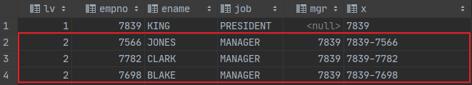
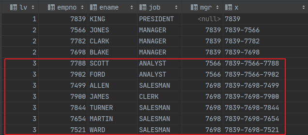
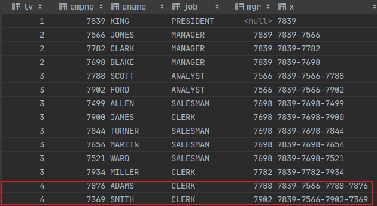
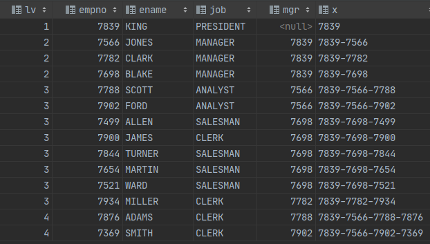
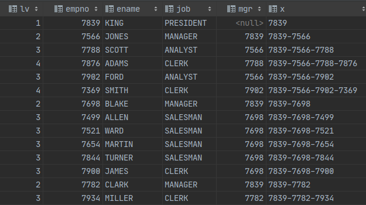

# Recursive CTE를 사용해서 계층형 구조 만들기

Oracle에 Start With를 사용해서 계층구조를 표현한다면, ANSI SQL에서는 **Recursive CTE를 사용해서 계층구조를 표현**할 수 있습니다.

## 1. 환경

테스트시 사용한 환경과 버전은 아래와 같습니다. 예제에 사용된 데이터는 포스팅 마지막에 있습니다.

* Oracle 11.2 xe
* MariaDB 10.4

## 2. CTE 란

* Common Table Expression의 약자로 '공통 테이블 식'이라 하며, SELECT, INSERT, UPDATE, DELETE문에서 참조할 수 있는 **임시 결과 집합** 입니다.
* `WITH` 연산자를 사용해서 CTE를 정의할 수 있으며, ANSI-SQL99 표준에서 나왔으므로 대다수 데이터베이스에서 사용할 수 있습니다.
* CTE는 VIEW처럼 개체로 저장되지 않고, 쿼리 지속시간에만 존재하며, **Recursive(재귀)** 를 사용할 수 있습니다.
* CTE는 **정의와 동시에 사용**해야 합니다.

## 3. CTE 기본 사용 방법

CTE의 기본 문법은 `WITH CTE 이름 AS (CTE Body) CTE USING` 입니다.

`C`가 **CTE 이름**이며, `select colunm_name FROM table_name`가 **CTE Body** 이며, `SELECT * FROM C`가 **정의한 CTE를 사용**하는 부분입니다.

```SQL
with C as (
    select colunm_name
    from table_name
)
select *
from C;
```

## 3. Recursive CTE 란

Recursive CTE란 말 그대로 재귀 CTE로 CTE 자기 자신을 참조하는 것을 뜻합니다.

Recursive CTE의 기본 문법은 CTE 이름 앞에 Recursive를 붙인 `WITH RECURSIVE CTE 이름 AS (CTE Body) CTE USING` 입니다.

union 전에 있는 `select anchor_data FROM tabel_anme` 부분이 Recursive의 시작점이기 때문에 **Anchor part**라 하며, union 뒤에 있는 `select recursive_part from R, ...` 부분이 Recursive가 되는 부분이기 때문에 **Recursive part** 라고 합니다.

```SQL
with recursive RC as (
  select anchor_data
  FROM tabel_anme
  union [all]
  select recursive_part
  from R, ...
)
select *
FROM RC
```

## 4. Recursive CTE 예제

```SQL
with recursive cte AS(
    select 1 as lv, empno, ename, job, mgr, cast(empno as char(99)) x
    from emp
    where job = 'PRESIDENT'
    union
    select b.lv + 1 as lv, p.empno, p.ename, p.job, p.mgr, concat(b.x, '-', p.empno) x
    from emp p inner join cte b on p.mgr = b.empno
)
SELECT *
FROM cte
```

위의 Recursive 쿼리의 실행 순서는 아래와 같습니다.

### 4-1. Anchor part

Anchor part인 아래 쿼리가 실행되어 **job이 PRESIDENT인 KING이 기준**이 됩니다.

```SQL
select 1 as lv, empno, ename, job, mgr, cast(empno as char(99)) x
from emp
where job = 'PRESIDENT'
```


### 4-2. Recursive part 1

Recursive part인 아래 쿼리가 실행되어 위의 결과의 **empno(7839)와 일치하는 mgr을 찾습니다.**

```SQL
select b.lv + 1 as lv, p.empno, p.ename, p.job, p.mgr, concat(b.x, '-', p empno) x
from emp p inner join cte b on p.mgr = b.empno
```



### 4-3. Recursive part 2

또 다시 Recursive part인 아래 쿼리가 실행되어 의의 결과의 **empno(7566,7782,7698)과 일치하는 mgr을 찾습니다.**

```SQL
select b.lv + 1 as lv, p.empno, p.ename, p.job, p.mgr, concat(b.x, '-', p empno) x
FROM emp p INNER JOIN cte b ON p.mgr = b.empno
```



### 4-4. Recursive part 3

또 다시 Recursive part인 아래 쿼리가 실행되어 의의 결과의 **empno(7788,7902,7499,7900,7844,7654,7521)과 일치하는 mgr을 찾습니다.**

```SQL
select b.lv + 1 as lv, p.empno, p.ename, p.job, p.mgr, concat(b.x, '-', p empno) x
from emp p inner join cte b on p.mgr = b.empno
``` 



### 4-5. Recursive part 4

더이상 **empno와 mgr이 일치하는 정보가 없기 때문에 Recursive CTE는 종료**되며 아래 쿼리에 의해 전체 정보를 출력 합니다.

```SQL
select *
from cte
```

아래 결과는 정렬을 하지 않은 데이터 이기 때문에, 정상적인 계층구조를 확인 하기 위해서는 ordey by를 해줘야 합니다.



### 4-6. Recursive CTE 예제 결과

최종적으로 Recursive CTE 결과에 대해 정렬을 해주면 아래와 같이 계층구조가 정상적으로 되있는 것을 알 수 있습니다.

```SQL
with recursive cte as(
    select 1 as lv, empno , ename, job, mgr, cast(empno as char(99)) x
    from EMP
    where job = 'PRESIDENT'
    union
    select b.lv + 1 as lv, p.empno, p.ename, p.job, p.mgr, concat(b.x, '-', p.empno) x
    from EMP p
    inner join cte b on p.mgr = b.empno
)
select *
from cte
order by x
```



## 5. Oracle Start With와 Recursive CTE

Oracle의 Start With 구문을 Recursive CTE를 사용해서 동일하게 계층 구조를 표현 할 수 있습니다.

```SQL
SELECT LEVEL, EMPNO, ENAME, JOB, MGR
FROM emp
START WITH job = 'PRESIDENT'
CONNECT BY PRIOR EMPNO = MGR;
```

```SQL
with recursive cte as(
    select 1 as lv, empno , ename, job, mgr, cast(empno as char(99)) x
    from EMP
    where job = 'PRESIDENT'
    union
    select b.lv + 1 as lv, p.empno, p.ename, p.job, p.mgr, concat(b.x, '-', p.empno) x
    from EMP p
    inner join cte b on p.mgr = b.empno
)
select *
from cte
order by x
```

## 5. DB별 CTE 지원버전

* MySQL 8.0 부터 지원
* Oracle 11g R2 부터 지원
* MariaDB 10.2 부터 지원

## 6. 참고자료

[MariaDB Recursive Common Table Expressions Overview](https://mariadb.com/kb/en/library/recursive-common-table-expressions-overview/>)

## 테스트 데이터

예제에 사용된 테스트 데이터는 아래와 같습니다.

### Oracle

```SQL
create table emp
(
    EMPNO    NUMBER(4) not null,
    ENAME    VARCHAR2(10),
    JOB      VARCHAR2(9),
    MGR      NUMBER(4),
    HIREDATE DATE,
    SAL      NUMBER(7, 2),
    COMM     NUMBER(7, 2),
    DEPTNO   NUMBER(2)
);


INSERT INTO emp (EMPNO, ENAME, JOB, MGR, HIREDATE, SAL, COMM, DEPTNO) VALUES (7369, 'SMITH', 'CLERK', 7902, TO_DATE('1980-12-17 00:00:00', 'YYYY-MM-DD HH24:MI:SS'), 800.00, null, 20);
INSERT INTO emp (EMPNO, ENAME, JOB, MGR, HIREDATE, SAL, COMM, DEPTNO) VALUES (7499, 'ALLEN', 'SALESMAN', 7698, TO_DATE('1981-02-20 00:00:00', 'YYYY-MM-DD HH24:MI:SS'), 1600.00, 300.00, 30);
INSERT INTO emp (EMPNO, ENAME, JOB, MGR, HIREDATE, SAL, COMM, DEPTNO) VALUES (7521, 'WARD', 'SALESMAN', 7698, TO_DATE('1981-02-22 00:00:00', 'YYYY-MM-DD HH24:MI:SS'), 1250.00, 500.00, 30);
INSERT INTO emp (EMPNO, ENAME, JOB, MGR, HIREDATE, SAL, COMM, DEPTNO) VALUES (7566, 'JONES', 'MANAGER', 7839, TO_DATE('1981-04-02 00:00:00', 'YYYY-MM-DD HH24:MI:SS'), 2975.00, null, 20);
INSERT INTO emp (EMPNO, ENAME, JOB, MGR, HIREDATE, SAL, COMM, DEPTNO) VALUES (7654, 'MARTIN', 'SALESMAN', 7698, TO_DATE('1981-09-28 00:00:00', 'YYYY-MM-DD HH24:MI:SS'), 1250.00, 1400.00, 30);
INSERT INTO emp (EMPNO, ENAME, JOB, MGR, HIREDATE, SAL, COMM, DEPTNO) VALUES (7698, 'BLAKE', 'MANAGER', 7839, TO_DATE('1981-05-01 00:00:00', 'YYYY-MM-DD HH24:MI:SS'), 2850.00, null, 30);
INSERT INTO emp (EMPNO, ENAME, JOB, MGR, HIREDATE, SAL, COMM, DEPTNO) VALUES (7782, 'CLARK', 'MANAGER', 7839, TO_DATE('1981-06-09 00:00:00', 'YYYY-MM-DD HH24:MI:SS'), 2450.00, null, 10);
INSERT INTO emp (EMPNO, ENAME, JOB, MGR, HIREDATE, SAL, COMM, DEPTNO) VALUES (7788, 'SCOTT', 'ANALYST', 7566, TO_DATE('1982-12-09 00:00:00', 'YYYY-MM-DD HH24:MI:SS'), 3000.00, null, 20);
INSERT INTO emp (EMPNO, ENAME, JOB, MGR, HIREDATE, SAL, COMM, DEPTNO) VALUES (7839, 'KING', 'PRESIDENT', null, TO_DATE('1981-11-17 00:00:00', 'YYYY-MM-DD HH24:MI:SS'), 5000.00, null, 10);
INSERT INTO emp (EMPNO, ENAME, JOB, MGR, HIREDATE, SAL, COMM, DEPTNO) VALUES (7844, 'TURNER', 'SALESMAN', 7698, TO_DATE('1981-09-08 00:00:00', 'YYYY-MM-DD HH24:MI:SS'), 1500.00, null, 30);
INSERT INTO emp (EMPNO, ENAME, JOB, MGR, HIREDATE, SAL, COMM, DEPTNO) VALUES (7876, 'ADAMS', 'CLERK', 7788, TO_DATE('1983-01-12 00:00:00', 'YYYY-MM-DD HH24:MI:SS'), 1100.00, null, 20);
INSERT INTO emp (EMPNO, ENAME, JOB, MGR, HIREDATE, SAL, COMM, DEPTNO) VALUES (7900, 'JAMES', 'CLERK', 7698, TO_DATE('1981-12-03 00:00:00', 'YYYY-MM-DD HH24:MI:SS'), 950.00, null, 30);
INSERT INTO emp (EMPNO, ENAME, JOB, MGR, HIREDATE, SAL, COMM, DEPTNO) VALUES (7902, 'FORD', 'ANALYST', 7566, TO_DATE('1981-12-03 00:00:00', 'YYYY-MM-DD HH24:MI:SS'), 3000.00, null, 20);
INSERT INTO emp (EMPNO, ENAME, JOB, MGR, HIREDATE, SAL, COMM, DEPTNO) VALUES (7934, 'MILLER', 'CLERK', 7782, TO_DATE('1982-01-23 00:00:00', 'YYYY-MM-DD HH24:MI:SS'), 1300.00, null, 10);
```

### MariaDB

```SQL
create table emp
(
    EMPNO    NUMBER(4) not null,
    ENAME    VARCHAR2(10),
    JOB      VARCHAR2(9),
    MGR      NUMBER(4),
    HIREDATE DATE,
    SAL      NUMBER(7, 2),
    COMM     NUMBER(7, 2),
    DEPTNO   NUMBER(2)
);


INSERT INTO emp (EMPNO, ENAME, JOB, MGR, HIREDATE, SAL, COMM, DEPTNO) VALUES (7369, 'SMITH', 'CLERK', 7902, TO_DATE('1980-12-17 00:00:00', 'YYYY-MM-DD HH24:MI:SS'), 800.00, null, 20);
INSERT INTO emp (EMPNO, ENAME, JOB, MGR, HIREDATE, SAL, COMM, DEPTNO) VALUES (7499, 'ALLEN', 'SALESMAN', 7698, TO_DATE('1981-02-20 00:00:00', 'YYYY-MM-DD HH24:MI:SS'), 1600.00, 300.00, 30);
INSERT INTO emp (EMPNO, ENAME, JOB, MGR, HIREDATE, SAL, COMM, DEPTNO) VALUES (7521, 'WARD', 'SALESMAN', 7698, TO_DATE('1981-02-22 00:00:00', 'YYYY-MM-DD HH24:MI:SS'), 1250.00, 500.00, 30);
INSERT INTO emp (EMPNO, ENAME, JOB, MGR, HIREDATE, SAL, COMM, DEPTNO) VALUES (7566, 'JONES', 'MANAGER', 7839, TO_DATE('1981-04-02 00:00:00', 'YYYY-MM-DD HH24:MI:SS'), 2975.00, null, 20);
INSERT INTO emp (EMPNO, ENAME, JOB, MGR, HIREDATE, SAL, COMM, DEPTNO) VALUES (7654, 'MARTIN', 'SALESMAN', 7698, TO_DATE('1981-09-28 00:00:00', 'YYYY-MM-DD HH24:MI:SS'), 1250.00, 1400.00, 30);
INSERT INTO emp (EMPNO, ENAME, JOB, MGR, HIREDATE, SAL, COMM, DEPTNO) VALUES (7698, 'BLAKE', 'MANAGER', 7839, TO_DATE('1981-05-01 00:00:00', 'YYYY-MM-DD HH24:MI:SS'), 2850.00, null, 30);
INSERT INTO emp (EMPNO, ENAME, JOB, MGR, HIREDATE, SAL, COMM, DEPTNO) VALUES (7782, 'CLARK', 'MANAGER', 7839, TO_DATE('1981-06-09 00:00:00', 'YYYY-MM-DD HH24:MI:SS'), 2450.00, null, 10);
INSERT INTO emp (EMPNO, ENAME, JOB, MGR, HIREDATE, SAL, COMM, DEPTNO) VALUES (7788, 'SCOTT', 'ANALYST', 7566, TO_DATE('1982-12-09 00:00:00', 'YYYY-MM-DD HH24:MI:SS'), 3000.00, null, 20);
INSERT INTO emp (EMPNO, ENAME, JOB, MGR, HIREDATE, SAL, COMM, DEPTNO) VALUES (7839, 'KING', 'PRESIDENT', null, TO_DATE('1981-11-17 00:00:00', 'YYYY-MM-DD HH24:MI:SS'), 5000.00, null, 10);
INSERT INTO emp (EMPNO, ENAME, JOB, MGR, HIREDATE, SAL, COMM, DEPTNO) VALUES (7844, 'TURNER', 'SALESMAN', 7698, TO_DATE('1981-09-08 00:00:00', 'YYYY-MM-DD HH24:MI:SS'), 1500.00, null, 30);
INSERT INTO emp (EMPNO, ENAME, JOB, MGR, HIREDATE, SAL, COMM, DEPTNO) VALUES (7876, 'ADAMS', 'CLERK', 7788, TO_DATE('1983-01-12 00:00:00', 'YYYY-MM-DD HH24:MI:SS'), 1100.00, null, 20);
INSERT INTO emp (EMPNO, ENAME, JOB, MGR, HIREDATE, SAL, COMM, DEPTNO) VALUES (7900, 'JAMES', 'CLERK', 7698, TO_DATE('1981-12-03 00:00:00', 'YYYY-MM-DD HH24:MI:SS'), 950.00, null, 30);
INSERT INTO emp (EMPNO, ENAME, JOB, MGR, HIREDATE, SAL, COMM, DEPTNO) VALUES (7902, 'FORD', 'ANALYST', 7566, TO_DATE('1981-12-03 00:00:00', 'YYYY-MM-DD HH24:MI:SS'), 3000.00, null, 20);
INSERT INTO emp (EMPNO, ENAME, JOB, MGR, HIREDATE, SAL, COMM, DEPTNO) VALUES (7934, 'MILLER', 'CLERK', 7782, TO_DATE('1982-01-23 00:00:00', 'YYYY-MM-DD HH24:MI:SS'), 1300.00, null, 10);
```
