# Docker를 사용해서 MariaDB 설치하기

## 1. Docker image pull

mariadb 이미지를 pull 받습니다.

```bash
docker pull mariadb
```

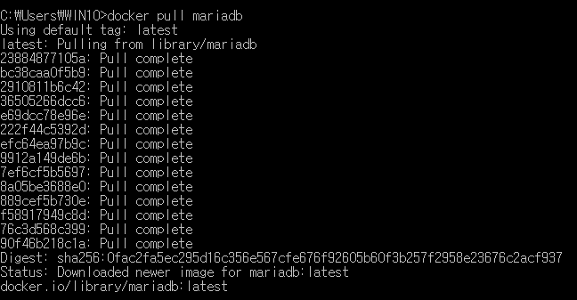

## 2. Docker Container 생성

pull 받은 Docker image를 Container로 생성합니다.

* --name : Container의 이름을 지정하는 옵션
* -d : 백그라운드 프로세스로 실행하는 옵션
* -p : 호스트와 포트와 Container의 포트를 매핑하는 옵션
* -e : 환경변수 옵션
  * MYSQL_ROOT_PASSWORD : MariaDB root 계정의 비밀번호를 설정하는 환경변수 입니다.
* mariadb : 이미지 이름

정리하면 Container의 이름은 mariadb이며, 백그라운드 프로세스로 실행하며, 호스트의 3306 포트는 Container의 3306 매핑되며, MariaDB의 root 계정 비밀번호는 mariadb이며, mariadb 이미지를 사용합니다.

```bash
docker run --name mariadb -d -p 3306:3306 -e MYSQL_ROOT_PASSWORD=mariadb mariadb
```

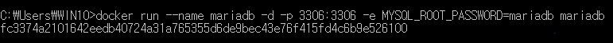

## 3. 접속 Test

DB Tool을 사용해서 접속이 되는지 확인해 보겠습니다.

기본 접속정보는 아래와 같습니다. Password는 docker run시 지정한 MYSQL_ROOT_PASSWORD의 값이며, Port는 docker run시 설정한 host의 포트를 적어주셔야 합니다.

* User : root
* Password : mariadb
* Port :3306

저는 DataGrip으로 진행하였으며, 아래와 같이 정상적으로 Connection이 되는 것을 볼 수 있습니다.

정상적으로 Connection이 되는 것을 확인했기 때문에 추가 설정을 진행하겠습니다.

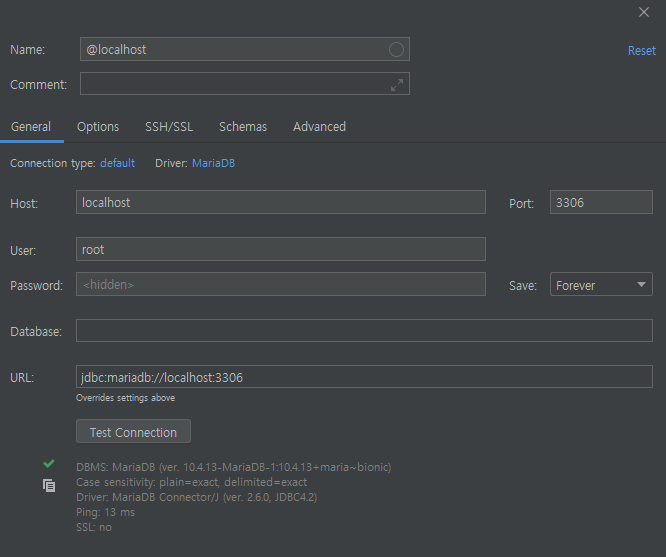

## 4. DB Timezone 확인

DB의 시간대를 확인해보기 위해 MariaDB Console에 접속합니다.

### 4-1. Container bash

* exec : 실행중인 Container에 명령을 실행 합니다.
* -it : -i -t 옵션을 합친 것으로 -i 옵션은 --interactive의 약자로 표준 입력을 활성화 하며, -t 옵션은 --tty의 약자로 proude-TTY를 Allocate 합니다.

즉, 아래 명령어는 Container 이름이 mariadb인 Container에 명령을 날릴수 있는 bash를 실행시킨다는 뜻입니다.

```bash
docker exec -it mariadb bash
```

### 4-2. MariaDB Console 접속

비밀번호는 run시 지정한 환경변수 MYSQL_ROOT_PASSWORD의 값이므로, 여기서는 mariadb가 됩니다.

```bash
mysql -u root -p
```


### 4-3. 시간대 확인

현재 시간은 2020-05-27 15:57분이나 아래 쿼리를 실행한 결과를 보면 2020-05-27 06:57:57임을 알 수 있습니다.

이러한 차이가 발생하는 이유는 MariaDB의 Timezone 기본적으로 OS의 시간을 따라가는데 OS의 시간이 잘못되어 있기 때문입니다.

```sql
SELECT CURRENT_TIMESTAMP;
```

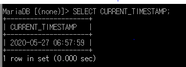

> MariaDB Time Zones : <https://mariadb.com/kb/en/time-zones>

### 4-4. OS 시간대 확인

OS의 시간대를 확인해 보면 시간대가 UTC로 잡혀 있는 것을 알 수 있습니다.

OS의 시간대가 다른 것을 확인 했기 때문에 시간대를 설정후 Container를 재시작 하면 MariaDB의 시간대도 자동으로 맞춰집니다.

```bash
date
```

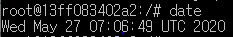

> 우리나라의 시간대는 UTC + 9 입니다.

## 5. OS 시간대 설정

### 5-1. OS 확인

현재 pull 받은 이미지의 OS는 Ubuntu 18.04 입니다.

```bash
cat /etc/issue
```

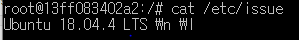

### 5-2. TimeZone 변경

아래와 같이 시간대를 Seoul로 변경 후 시간을 확인해 보면 현재 시간으로 변경되어 있습니다.

```bash
# 시간대 변경
ln -sf /usr/share/zoneinfo/Asia/Seoul /etc/localtime

# 시간 확인
date
```


### 5-3. Container 재시작

변경된 시간을 MariaDB에 적용하기 위해 Container를 재시작 합니다.

```bash
docker restart [CONTAINER_ID]
```

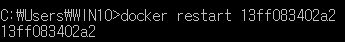

## 6. DB Timezone 확인

아래와 같이 시간대를 다시 확인해 보면 OS의 시간대가 변경되었기 때문에 MariaDB에도 정상적으로 적용된 것을 알 수 있습니다.

```sql
SELECT CURRENT_TIMESTAMP;
```

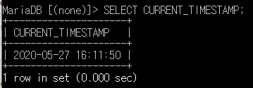

## 7. Charset 확인

설정된 Charset를 보면 latin1로 되어 있습니다. 해당 Charset인 상태에서 한글 사용시에는 문제가 발생할 수 있기 때문에 Charset를 utf8mb4로 변경하겠습니다.

```sql
status
```

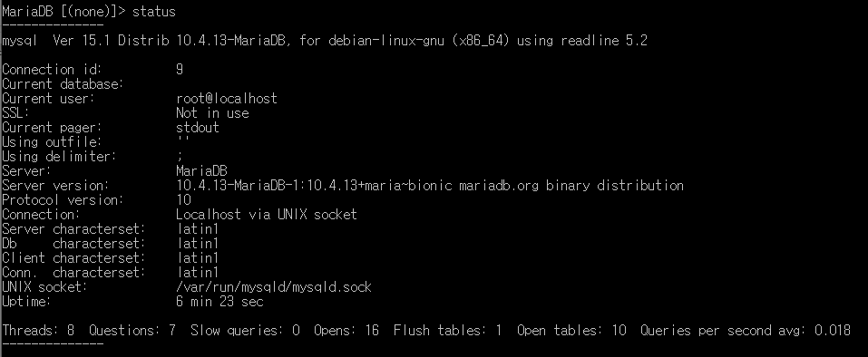

> Enabling Multilingual Support with Unicode Databases : https://docs.oracle.com/cd/E11882_01/server.112/e10729/ch6unicode.htm#NLSPG317

### 7-1. Charset 변경

/etc/mysql/my.cnf 파일을 열어서 아래의 내용을 추가 합니다.

* skip-character-set-client-handshake 옵션은 클라이언트의 인코딩 설정을 무시하고 DB Server의 인코딩을 사용하겠다는 설정입니다.
* utf8이 아닌 utf8mb4를 사용한 이유는 MariaDB에서 utf8은 가변형 3Byte 이며, utf8mb4는 가변형 4byte 입니다. 예를들어 4byte를 차지하는 이모지 같은 경우는 값이 손실되기 때문입니다.

```bash
[mysqld]
skip-character-set-client-handshake
collation-server = utf8mb4_unicode_ci
character-set-server = utf8mb4
```

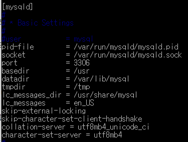

> utf8은 가변형 4byte이나 MySQL이나 MariaDB에서는 utf8을 가변형 3byte로 사용합니다.

### 7-2. 변경된 Charset 확인

위의 설정을 완료 후 Container를 재시작 해준 뒤 Charset를 확인해 보면 아래와 같이 latin1이 었던 characterset이 utf8mb4로 변경된 것을 알 수 있습니다.

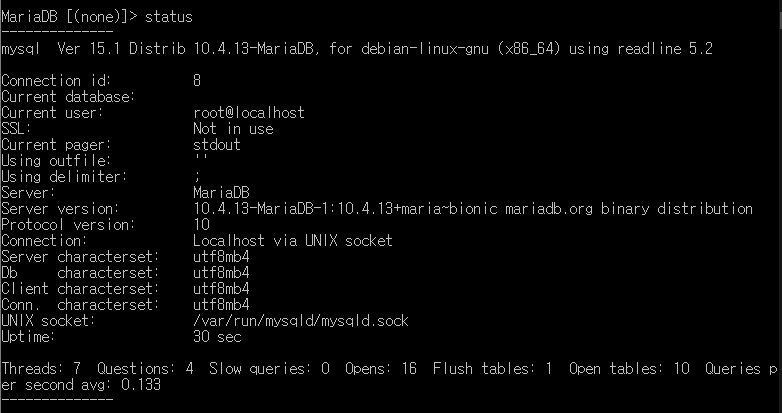