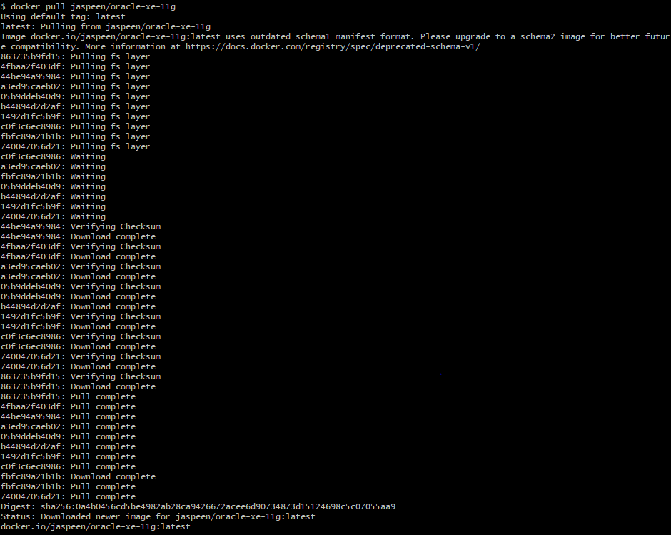
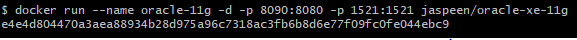
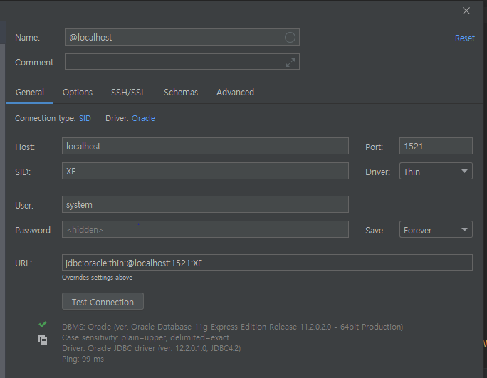
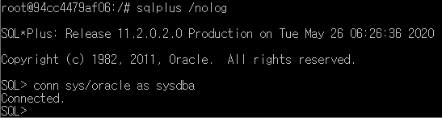
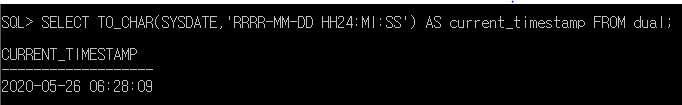
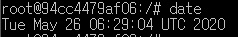
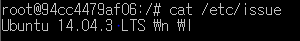
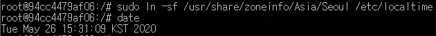
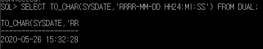
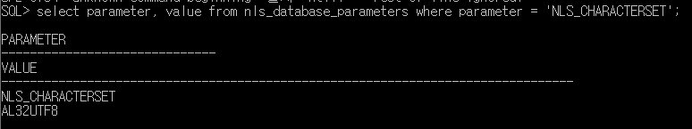

# Docker를 사용해서 Oracle 11 xe 설치하기

## 1. Docker image pull

jaspeen/oracle-xe-11g 이미지를 pull 받습니다.

```bash
docker pull jaspeen/oracle-xe-11g
```



## 2. Docker Container 생성

pull 받은 Docker image를 Container로 생성합니다.

* --name : Container의 이름을 지정하는 옵션
* -d : 백그라운드 프로세스로 실행하는 옵션
* -p : 호스트와 포트와 Container의 포트를 매핑하는 옵션
* jaspeen/oracle-xe-11g : 이미지 이름

정리하면, Container의 이름은 oracle-11g이며, 백그라운드 프로세스로 실행하며, 호스트의 8090 포트는 Container의 8080으로 매핑되며, 호스트의 1521 포트는 Container의 1521로 매핑되며, jaspeen/oracle-xe-11g 이미지를 사용합니다.

```bash
docker run --name oracle-11g -d -p 8090:8080 -p 1521:1521 jaspeen/oracle-xe-11g
```



> 8080은 XML DB Port이며, 1521은 Oracle listner 포트입니다.

## 3. 접속 Test

DB Tool을 사용해서 접속이 되는지 확인해 보겠습니다.

기본 접속정보는 아래와 같습니다. Port는 docker run시 설정한 host의 포트를 적어주셔야 합니다.

* User : system
* Password : oracle
* Port : 1521
* SID : XE

저는 DataGrip으로 진행하였으며, 아래와 같이 정상적으로 Connection이 되는 것을 볼 수 있습니다.

정상적으로 Connection이 되는 것을 확인했기 때문에 추가 설정을 진행하겠습니다.



## 4. DB Timezone 확인

DB의 시간대를 확인해보기 위해 sqlplus에 접속합니다.

### 4-1. Container bash

* exec : 실행중인 Container에 명령을 실행 합니다.
* -it : -i -t 옵션을 합친 것으로 -i 옵션은 --interactive의 약자로 표준 입력을 활성화 하며, -t 옵션은 --tty의 약자로 proude-TTY를 Allocate 합니다.

즉, 아래 명령어는 Container 이름이 oracle-11g 인 Container에 명령을 날릴수 있는 bash를 실행시킨다는 뜻입니다.

```bash
docker exec -it oracle-11g bash
```

### 4-2. 관리자 권한으로 sqlplus 접속

```bash
# 로그인 없이 sqlplus 접속
sqlplus /nolog

# 관리자 권한으로 접속
conn sys/oracle as sysdba
```



### 4-3. 시간대 확인

현재 시간은 2020-05-26 15:28분이나 아래 쿼리를 실행한 결과를 보면 2020-05-26 06:28:09임을 알 수 있습니다.

이러한 차이가 발생하는 이유는 Oracle의 Timezone은 기본적으로 OS의 시간을 따라가는데 OS의 시간이 잘못되어 있기 때문입니다.

```sql
SELECT TO_CHAR(SYSDATE,'RRRR-MM-DD HH24:MI:SS') FROM DUAL;
```



### 4-4. OS 시간대 확인

OS의 시간대를 확인해 보면 시간대가 UTC로 잡혀 있는 것을 알 수 있습니다.

OS의 시간대가 다른 것을 확인 했기 때문에 시간대를 설정해 주면 Oracle의 시간대도 자동으로 맞춰집니다.

```bash
date
```



> 우리나라의 시간대는 UTC + 9 입니다.

## 5. OS 시간대 설정

### 5-1. OS 확인

현재 pull 받은 이미지의 OS는 Ubuntu 14.04 입니다.

```bash
cat /etc/issue
```



### 5-2. TimeZone 변경

아래와 같이 시간대를 Seoul로 변경 후 시간을 확인해 보면 현재 시간으로 변경되어 있습니다.

```bash
# 시간대 변경
sudo ln -sf /usr/share/zoneinfo/Asia/Seoul /etc/localtime

# 시간 확인
date
```



## 6. DB Timezone 확인

아래와 같이 시간대를 다시 확인해 보면 OS의 시간대가 변경되었기 때문에 Oracle에도 정상적으로 적용된 것을 알 수 있습니다.

```sql
SELECT TO_CHAR(SYSDATE,'RRRR-MM-DD HH24:MI:SS') FROM DUAL;
```



## 7. Charset 확인

설정된 Charset를 보면 AL32UTF8로 되어 있습니다. 해당 Charset는 최신 버전의 유니 코드 표준을 지원하기 때문에 문제 없이 사용할 수 있습니다.

* AL32UTF8
  * AL32UTF8 문자 집합은 최신 버전의 유니 코드 표준을 지원합니다. 문자를 1, 2 또는 3 바이트로 인코딩합니다. 보충 문자에는 4 바이트가 필요합니다. ASCII 기반 플랫폼 용입니다.
* UTF8
  * 그만큼 UTF8 문자 세트는 1, 2 또는 3 바이트로 문자를 인코딩합니다. ASCII 기반 플랫폼 용입니다. UTF8 데이터베이스에 삽입 된 보충 문자는 데이터베이스의 데이터를 손상시키지 않습니다. 보충 문자는 6 바이트를 차지하는 두 개의 별도의 사용자 정의 문자로 취급됩니다. 데이터베이스 문자 세트에서 보충 문자를 완전히 지원하려면 AL32UTF8로 전환하는 것이 좋습니다.

```sql
select parameter, value from nls_database_parameters where parameter = 'NLS_CHARACTERSET'
```



> Enabling Multilingual Support with Unicode Databases : <https://docs.oracle.com/cd/E11882_01/server.112/e10729/ch6unicode.htm#NLSPG317>

## 8. DB 생성

설정이 모두 끝났으니, DB를 생성해 보겠습니다.

### 8-1. Table Space 생성

* SIZE : 초기 데이터 파일 크기 입니다.
* AUTOEXTEND : 초기 크기 공간을 모두 사용하는 경우 자동으로 파일의 크기가 커지도록 하는 설정입니다.
* NEXT : 데이터파일이 증가하는 단위 입니다.
* MAXSIZE : 데이터파일이 최대로 커질 수 있는 크기로, 기본값은 unlimited 입니다.

```sql
CREATE TABLESPACE dummy
DATAFILE 'dummy.dbf' SIZE 10M
AUTOEXTEND ON
NEXT 512K
MAXSIZE 250M;
```

### 8-2. User 생성

username은 dummy_user 이며, password는 dummy_user_password 이며, 기본 TableSpace는 위에서 생성한 dummy인 계정을 생성하였습니다.

```sql
CREATE USER dummy_user
IDENTIFIED BY dummy_user_password
DEFAULT TABLESPACE dummy
TEMPORARY TABLESPACE TEMP;
```

### 8-3. 권한 부여

생성한 계정에 대해 권한을 부여해 줍니다.

* RESOURCE Roll : User가 개체를 생성, 변경, 제거 할 수 있는 권한 입니다.
* CONNECT Roll : User가 Database에 접속 할 수 있는 Session 생성, 테이블 생성 및 조회 할 수 있는 권한 입니다.

```sql
GRANT RESOURCE, CONNECT TO dummy_user;
```