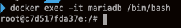
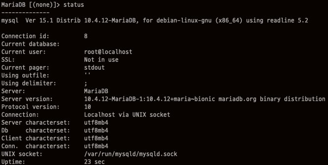

# Docker를 사용해서 MariaDB 설치하기

## 1. MariaDB image 다운로드

```
docker pull mariadb
```


## 2. Container 시작

````
docker run --name mariadb -d -p 3306:3306 -e MYSQL_ROOT_PASSWORD=mariadb mariadb
````

- ``--name``은 **Container의 이름** 으로 mariadb로 설정하였습니다.

- ``-d`` 는 detached mode로 **Container가 백그라운드로** 실행됩니다.

- ``-p``는 **Host와 Container의 포트를 연결**하는 것으로 Host에서  3306 포트로 접속시 Container 3306으로 포워딩 되도록 한 설정 입니다.

- ``-e``는 **Container 내에서 사용할 환경변수**로 MYSQL_ROOT_PASSWORD는 root 계정의 password 를 설정하기 위한 환경변수 입니다.

- 마지막에 있는 mariadb는 위에서 pull한 **image 이름** 입니다.


## 3. Container bash에 접속

```
docker exec -it mariadb /bin/bash
```

- ``exec``를 통해 **Container에 특정 명령을 실행**할수 있습니다.

- ``-it``는 -i와 -t의 옵션을 합친 것으로 **Container에서 Bash를 사용할 수 있습니다.**

- mariadb는 run시 지정한 **Container의 이름**입니다.

- /bin/bash는 **bash Shell에 연결**하겠다는 의미입니다.

    
  
     명령을 실행 후 터미널을 보면 root 계정으로 Container Bash에 접속한 것을 알 수 있습니다.



## 3. MariaDB 접속

드디어 mysql -u root -p 를 통해 MariaDB에 접속할 수 있습니다. **비밀번호는 docker run시 환경변수로 설정한 MYSQL_ROOT_PASSWORD의 값**입니다.

## 4. MariaDB characterset 설정

`status` 명령어를 사용해서 MariaDB의 설정정보를 볼수 있는데 characterset을 보면 **Server와 DB의 characterset이 latin1**로 되어 있는 것을 알 수 있습니다. latin1에서는 한글이 깨질 수 있기 때문에 **UTF8로 변경**해 줘야 합니다.


`/etc/mysql/my.cnf` 파일에서 내용을 아래와 같이 추가/수정해 줍니다.

    [client]
    default-character-set = utf8mb4
    
    [mysql]
    default-character-set = utf8mb4
    
    [mysqld]
    collation-server = utf8_unicode_ci
    init-connect='SET NAMES utf8'
    character-set-server = utf8

변경한 설정을 저장하기 위해 Container를 restart 해줍니다. Container의 ID는 `docker ps` 명령어를 사용해서 확인할 수 있습니다.

    docker restart [CONTAINER ID]

Container bash에 접속합니다.

```
docker exec -it mariadb /bin/bash
```

MariaDB에 접속해서 다시 Characterset을 확인해 보면 **Server와 DB 모두 UTF8로 변경**된 것을 알 수 있습니다.



