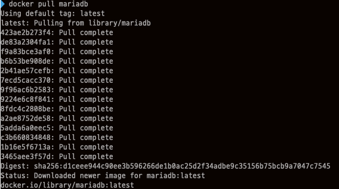
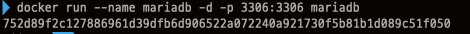
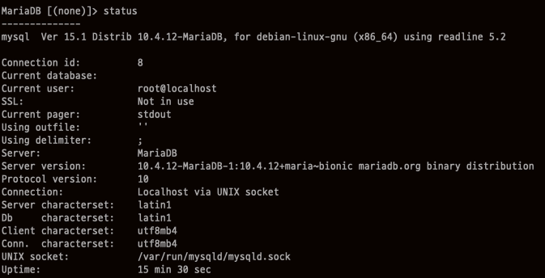

# Docker를 사용해서 MariaDB 설치 하기

## 환경정보

- Mac Catalina
- Docker Client Version 19.03.5
- Docker Server engine Version 19.03.5
- Docker Server containerd Version 1.2.10
- Docker Server runc Version 1.0.0-rc8+dev
- Docker Server docker-init Version 0.18.0

## 1. MariaDB image 다운로드

    docker pull mariadb



## 2. Container 시작

- --name은 `Container의 이름` 으로 mariadb로 설정하였습니다.
- -d 는 detached mode로 `Container가 백그라운드로` 실행됩니다.
- -p는 Host와 Container의 `포트를 연결`하는 것으로 Host에서  3306 포트로 접속시 Container 3306으로 포워딩 되도록 한 설정 입니다.
- -e는 `Container 내에서 사용할 환경변수로` MYSQL_ROOT_PASSWORD는 root 계정의 password 를 설정하기 위한 환경변수 입니다.
- 마지막으로 mariadb는 위에서 pull한 image 이름 입니다.

    docker run --name mariadb -d -p 3306:3306 -e MYSQL_ROOT_PASSWORD=mariadb mariadb

Container가 정상적으로 실행되었다면 아래 처럼 나타납니다.



## 3. Container bash에 접속

- exec를 통해 `Container에 특정 명령을 실행할` 수 있습니다.
- -it는 -i와 -t의 옵션을 합친 것으로 `Container에서 Bash를 사용할 수 있습니다.`
- mariadb는 run시 지정한 Container의 이름입니다.
- /bin/bash는 bash Shell에 연결하겠다는 의미입니다.

    docker exec -it mariadb /bin/bash

해당 명령을 실행 후 root 계정으로 Container에 Bash에 접속한 것을 알 수 있습ㄴ디ㅏ.


## 3. MariaDB 환경설정

드디어 `mysql -u root -p` 를 통해 MariaDB에 접속할 수 있습니다. 비밀번호는 docker run시 환경변수로 설정한 MYSQL_ROOT_PASSWORD의 값입니다.

아래 사진을 보면 `status` 명령어를 사용해서 MariaDB의 정보를 볼수 있는데 characterset을 보면 Server와 DB의 characterset이 latin1로 되어 있는 것을 알 수 있습니다. latin1에서는 한글이 깨질 수 있기 때문에 UTF8로 변경해 줘야 합니다.



`/etc/mysql/my.cnf` 파일에서 내용을 아래와 같이 추가/수정해 줍니다.

    [client]
    default-character-set = utf8mb4
    
    [mysql]
    default-character-set = utf8mb4
    
    [mysqld]
    collation-server = utf8_unicode_ci
    init-connect='SET NAMES utf8'
    character-set-server = utf8

변경한 설정을 저장하기 위해 Container를 restart 해줍니다. Container의 ID는 `docker ps` 명령어를 사용해서 확인할 수 있습니다.

    docker restart [CONTAINER ID]

Container bash에 접속합니다.

```
docker exec -it mariadb /bin/bash
```

`mysql -u root -p` 를 통해 MariaDB에 접속해서 다시 Characterset을 확인해 보면 Server와 DB 모두 UTF8로 변경된 것을 알 수 있습니다.

