# CentOS7에 MariaDB 설치하기

## 환경

* AWS EC2
* Centos 7.7
* MariaDB 10.5

편의를 위해 설치는 **root 계정**으로 진행 하였습니다.

## 1. OS 시간대 설정

EC2 인스턴스 생성시 시간대가 UTC로 되어 있기 때문에 **KST로 변경**해 줍니다.

```bash
date
```

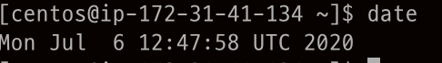

```bash
ln -sf /usr/share/zoneinfo/Asia/Seoul /etc/localtime
```

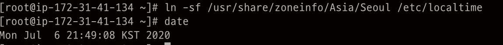

## 2. Setting up MariaDB Repositories

MariaDB를 yum을 사용해서 원하는 Version을 설치하기위해 [Setting up MariaDB Repositories](https://downloads.mariadb.org/mariadb/repositories/#mirror=harukasan)에 접속해서 OS 및 MariaDB Version을 선택 후 **Repository를 추가**해 줍니다.

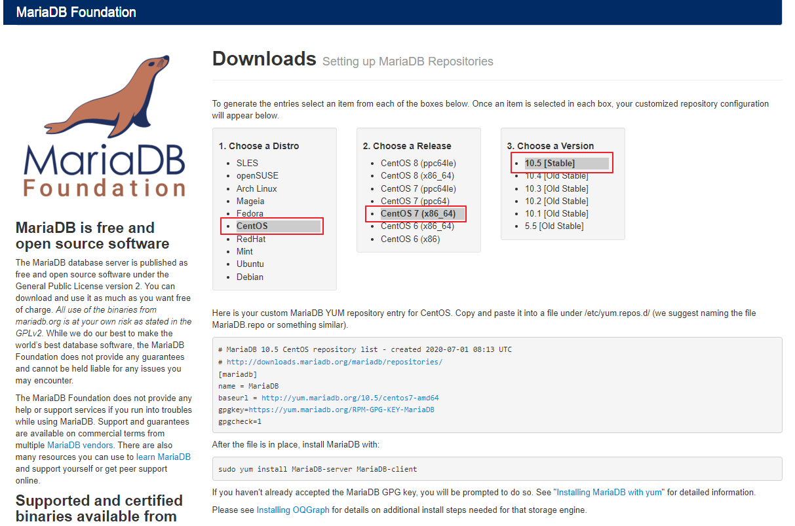

```bash
vi /etc/yum.repos.d/MariaDB.repo
```

```bash
# MariaDB 10.5 CentOS repository list - created 2020-07-01 08:25 UTC
# http://downloads.mariadb.org/mariadb/repositories/
[mariadb]
name = MariaDB
baseurl = http://yum.mariadb.org/10.5/centos7-amd64
gpgkey=https://yum.mariadb.org/RPM-GPG-KEY-MariaDB
gpgcheck=1
```

## 3. MariaDB 설치

yum Repository에 MariaDB Repository를 추가햐였으므로 **MariaDB를 설치** 하겠습니다.

```bash
yum -y install MariaDB-server
```

설치가 정상적으로 완료 되었다면 아래 사진과 같이 선택한 MariaDB Version이 설치된 것을 알 수 있습니다.

```bash
rpm -qa | grep MariaDB
```

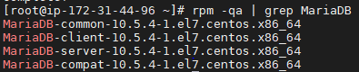

## 4. MariaDB 실행

Service start 후 정상적으로 프로세스가 실행되었다면 `Active가 active(running)`으로 표시됩니다.

```bash
# MariaDB 시작
systemctl start mariadb

# MariaDB Servuce 상태 확인
systemctl status mariadb
```

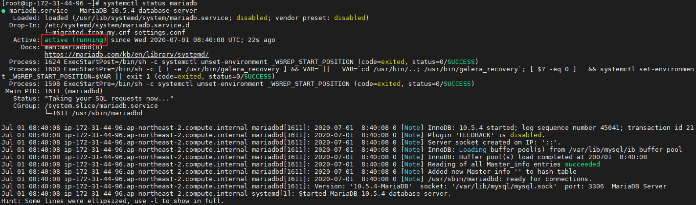

다음으로 **부팅시 MariaDB가 자동으로 구동**될 수 있도록 합니다.

```bash
systemctl enable mariadb
```

## 5. MariaDB 보안설정

**MariaDB의 기본적인 보안설정**을 진행하기 위해 아래 명령어를 실행합니다.

```bash
mysql_secure_installation
```

* Enter current password for root (enter for none):
  * MariaDB의 **root 계정의 패스워드를 입력하는 질문**으로, 현재 root 계정의 비밀번호가 없으므로 **Enter로 패스**합니다.
* Switch to unix_socket authentication [Y/n]
  * `unix_socket authentication`를 사용하면 **시스템의 root 계정을 사용해서 MariaDB root 계정으로 바로 로그인** 할 수 있는 기능입니다.
  * 개인적으로 보안상 취약하다 생각해서 `N`를 선택하였습니다.
* Change the root password?
  * **MariaDB root 계정의 변경여부**로, root 계정의 비밀번호를 설정한 적이 없으므로 `Y`를 선택 후 root 계정의 비밀번호를 설정하였습니다.
* Remove anonymous users?
  * **익명 사용자 삭제 여부**로 익명 사용자는 보안에 좋지 않기 때문에 `Y`를 선택 하여 anonymous users를 삭제하였습니다.
* Disallow root login remotely?
  * **root 계정의 원격지 로그인 허용 여부**로 테스트 용으로 사용할 것 이기 때문에 `Y`를 선택하였습니다. **보안을 생각한다면 `N`를 선택**하셔야 합니다.
* Remove test database and access to it?
  * **test database 삭제여부**로, 불필요하기 때문에 `Y` 를 선택해서 삭제하였습니다.
* Reload privilege tables now?
  * **변경된 권한을 Table에 적용할지에 대한 설정**으로 설정을 적용하기 위해 `Y`를 선택하였습니다.

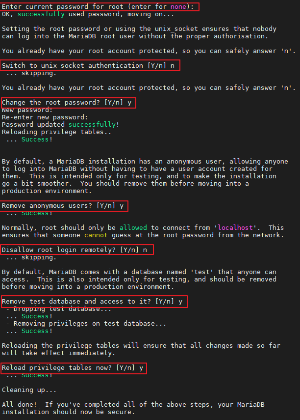

## 6. MariaDB Character set 설정

MariaDB의 Server Character set의 기본값은 `latin1`입니다. 해당 Character set은 한글 사용시 많은 문제가 발생하기 때문에 **Character set을 `utf8mb4`로 변경**하겠습니다.
> utf8mb4는 MySQL/MariaDB에 있는 Character set으로 4byte 가변형 입니다. utf8을 사용하여도 문제는 없지만, 추후 Emoji와 같은 4 Byte를 저장하기 위해서는 utf8mb4를 사용하는 것이 좋습니다.

현재 DB의 Character set을 확인해 보면 **Server/Db는 latin1**로 되어 있으며, **Client/Conn은 utf8**로 되어 있는 것을 알 수 있습니다.

```bash
status
```

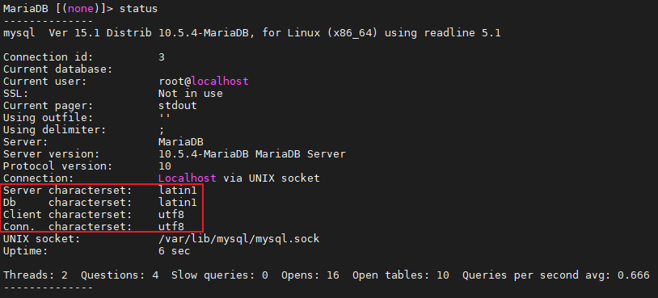

`/etc/my.cnf.d/server.cnf`에 들어가서 아래 내용을 추가합니다.

* skip-character-set-client-handshake 옵션은 **클라이언트의 인코딩 설정을 무시하고 DB Server의 인코딩을 사용**하겠다는 설정입니다.
* collation-server는 **데이터 정렬 설정**입니다.
* character-set-server는 **DB에 저장되는 데이터 character set 설정**입니다.

```bash
vi /etc/my.cnf.d/server.cnf

[mysqld]
skip-character-set-client-handshake
collation-server = utf8mb4_unicode_ci
character-set-server = utf8mb4
```

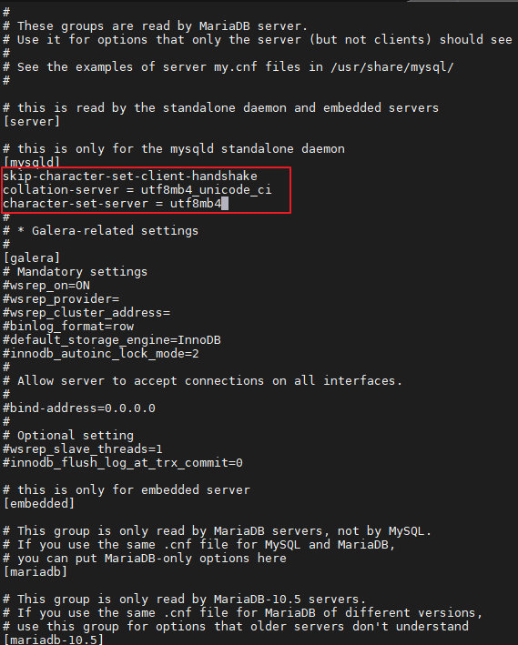

해당 설정 후 **MariaDB를 재시작** 합니다.

```bash
systemctl restart mariadb
```

MariaDB에 접속 후 `status`를 사용해서 Character set을 확인해 보면 모두 `utf8mb4`로 변경되있는 것을 알 수 있습니다.

```sql
status
```

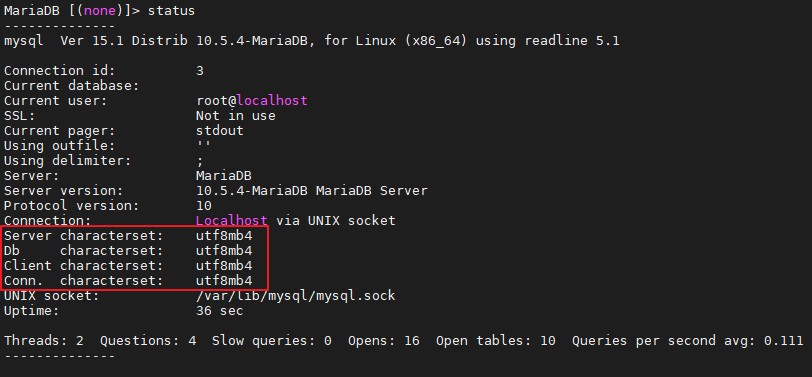

## 7. 외부에서 접속하기

외부에서 MariaDB에 접속하기 위해서는 아래 3가지 설정이 필요합니다.

### 7-1. OS 방화벽

해당 포스팅 에서는 AWS EC2를 사용하였기 때문에, 보안 그룹에서 **MariaDB Port인 3306을 허용**하였습니다.
> CentOS라면 firewall 또는 iptables Ubuntu라면 UFW에 해당 Port를 허용해 주셔야 합니다.

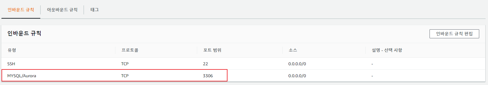

### 7-2. bind-address

MariaDB에서는 `bind-address`를 통해 **MariaDB에 접근할 수 있는 IP 대역대를 지정**할 수 있습니다.

저는 모든 IP 대역을 허용하기 위해 해당 설정을 주석처리 하였습니다.

```bash
vi /etc/my.cnf.d/server.cnf
```

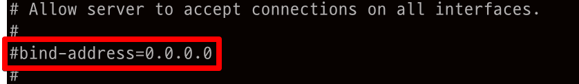

### 7-3. 사용자 권한

MariaDB는 **계정별로 특정 IP에 대한 접근권한 설정이 가능**합니다. 처음 설치 후 계정목록을 확인해 보면 root 계정은 `localhost`에서만 접속이 가능한 것을 알 수 있습니다.

```sql
use mysql
select host, user, password from user;
```

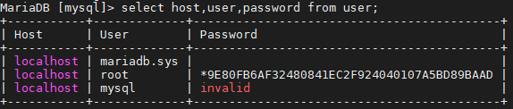

저는 root 계정을 사용해서 **어느 IP에서든 모든 DB에 접속을 할 수 있도록** 권한을 부여하였습니다.

```sql
grant all privileges on *.* to 'root'@'%';
```

그럼 아래와 같이 Host가 %인 root 계정이 생성되며, 해당 root 계정을 사용해서 어느 IP에서든 접속할 수 있습니다.

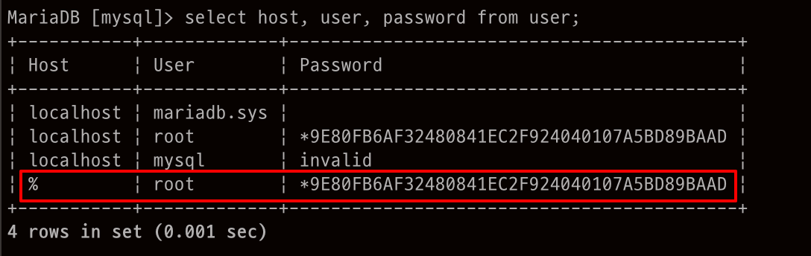

위의 쿼리에서 `identified by '패스워드'`를 붙여서 **같은 계정이라도 Host마다 비밀번호를 다르게 설정**할 수 있습니다.

```sql
grant all privileges on *.* to 'root'@'%' identified by 'abcdef';
```

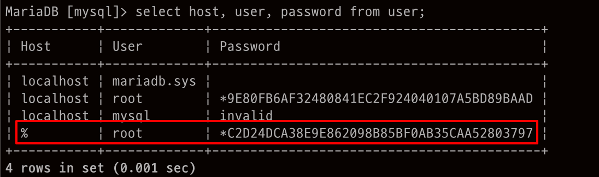

## 8. 계정 생성 및 권한부여

* `localhost`는 **localhost에서만 Access** 할 수 있습니다.
* `%`는 **모든 IP에서 Access** 할 수 있습니다.
* `IP 주소`를 사용하면 **특정IP 대역 또는 특정 IP에서만 Access**할 수 있습니다.
* 만약 **모든 DB 및 모든 Table에 대해 권한을 주고**싶다면, `데이터베이스이름.테이블명 to`에 `*.* to`를 사용하시면 됩니다.

### 8-1. 계정 생성

```sql
create user '계정명'@'localhost 또는 % 또는 ip 주소' identified by '비밀번호';
```

### 8-2. 권한 부여

```sql
grant all privileges on 데이터베이스이름.테이블명 to '계정명'@'localhost 또는 % 또는 ip 주소';
```

### 8-3. 계정 생성 및 권한부여

```sql
grant all privileges on 데이터베이스이름.테이블명 to '계정명'@'localhost 또는 % 또는 ip 주소' identified by '비밀번호';
```