# Tomcat Connector(mod_jk)를 사용한 apache Tomcat 연동

## 환경

* AWS EC2
* CentOS 7.7
* OpenJDK 11
* Apache 2.4.6
* Tomcat 9.0.36
* Tomcat Connector 1.2.48

해당 포스팅은 AWS EC2를 새로 생성해서 처음부터 진행하였습니다.

**Apache, mod_jk 설치 및 설정**은 `root 계정`으로 진행하였으며, **Tomcat 설치 및 설정**은 `dummy`라는 User를 생성해서 진행하였습니다.
> Tomcat 설치 및 설정을 User별로 진행한 이유는 **새로운 Project가 추가될 때마다 User 마다 Tomcat을 관리하기 위해서** 입니다.

## 1. root 계정 활성화

Apache 및 mod_jk 설치 및 설정을 위해 **root 계정을 활성화** 합니다.

```bash
# root 계정 비밀번호 설정
sudo passwd root

# root 계정으로 로그인
su - root
```

## 2. Time Zone 설정

현재 Time zone을 보면 KST가 아닌 UTC로 되어 있기 때문에 **Time Zone을 `KST`로 변경**합니다.

```bash
timedatectl
```

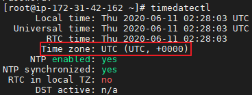

Time Zone 목록중 `Asia/Seoul`로 변경해 줍니다.

```bash
# Time Zone에서 Seoul 확인
timedatectl list-timezones | grep Seoul

# Time Zone Asia/Seoul로 변경
timedatectl set-timezone Asia/Seoul

# Time Zone 확인
timedatectl
```

이제 Time Zone을 확인해 보면 UTC에서 **`Asia/Seoul (KST)`로 변경**된 것을 알 수 있습니다.

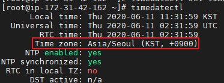

## 3. Package 최신화

세팅을 진행하기 전에 **Package를 최신화** 합니다.

```bash
yum -y update
```

## 4. JDK 설치

**Tomcat 9.0.x 대는 Java 8 이상을 지원**하기 때문에 `OpenJDK 11`을 설치하였습니다.

```bash
yum -y install java-11-openjdk-devel.x86_64
```

정상적으로 설치가 완료되었다면 아래의 사진과 같은 문구가 표시 됩니다.

```bash
java -version
```

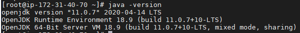

## 5. Apache 설치

Apache를 설치하는 방법은 `컴파일을 사용한 설치`와 `패키지 매니저를 사용한 설치` 방법이 있습니다. 해당 포스팅에서는 **패키지 매니저**를 통해 설치를 진행하겠습니다.

먼저 apache를 설치합니다.

```bash
yum -y install httpd
```

> Apache 홈 디렉토리는 `/etc/httpd` 입니다.

설치 버전을 확인해보면 **2.4.6 버전**이 설치됩니다.

```bash
httpd -v
```

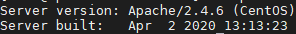

apache daemon을 시작합니다.

```bash
service httpd start
```

Apache의 상태를 확인해 보면 **Active가 active (running)** 인 것을 알 수 있으며, 브라우저에 접속하면 아래와 같이 Test 페이지가 나타납니다.

```bash
service httpd status
```

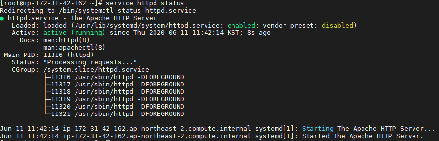

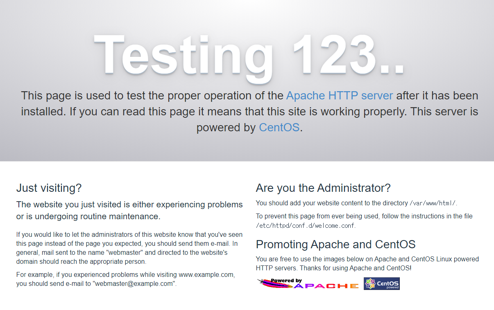

> 만약 해당 페이지 접속이 안된다면 **AWS의 경우에는 보안그룹 - 해당 인스턴스 보안 그룹 - 인바운드 규칙에서 80번 포트를 허용**해 줘야 합니다. 만약 AWS가 아닌 **Linux를 설치해서 사용하신다면 방화벽(firewall or iptables)에 80번 포트를 해제**해 주셔야 합니다.

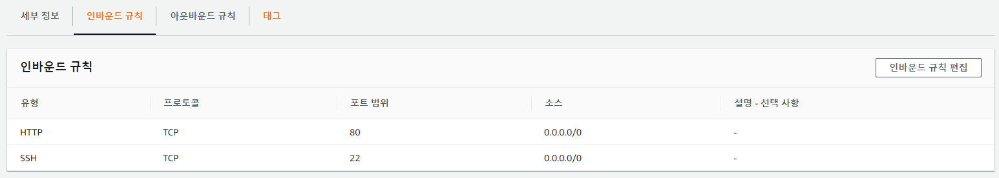

OS가 재부팅 되도 **Apache가 자동으로 실행되도록 설정**합니다.

```bash
systemctl enable httpd
```

## 6. Tomcat Connector 설치

이제 Apache와 Tomcat 연동에 필요한 `Tomcat Connector(mod_jk)`를 설치해 보겠습니다.

Tomcat Connector(mod_jk) 설치에는 `httpd-devel`과 `gcc`가 필요하기 때문에 미리 설치합니다.

```bash
yum -y install httpd-devel gcc
```

이제 Tomcat Connector를 다운로드 하겠습니다. **다운로드 경로**는 `/usr/local/tomcat`로 지정 했습니다.

```bash
wget http://apache.tt.co.kr/tomcat/tomcat-connectors/jk/tomcat-connectors-1.2.48-src.tar.gz -P /usr/local/tomcat
```

> 만약 다운로드가 안되신다면 <https://tomcat.apache.org/download-connectors.cgi>에 가셔서 아래 사진의 tar.gz에 URL로 다운로드 하시면 됩니다.

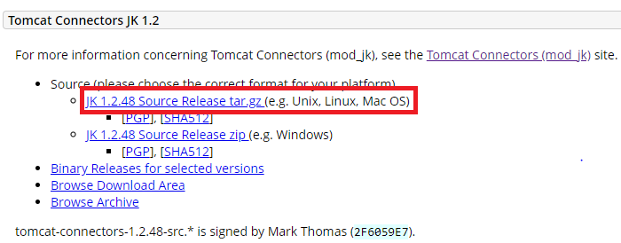

다운로드 받은 Tomcat-connector를 압축 해제 합니다.

```bash
tar -xvf /usr/local/tomcat/tomcat-connectors-1.2.48-src.tar.gz -C /usr/local/tomcat
```

Makefile을 생성합니다.

```bash
cd /usr/local/tomcat/tomcat-connectors-1.2.48-src/native/

./configure --with-apxs=/usr/bin/apxs
```

소스를 Compile 합니다.

```bash
make
```

설치를 진행 합니다.

```bash
make install
```

mod_jk가 정상적으로 설치 됬는지 확인합니다. 정상적으로 설치가 완료되었다면 `/etc/httpd/modules`에 **mod_jk.so 파일이 존재**합니다.

```bash
cd /etc/httpd/modules

ll | grep mod_jk.so
```

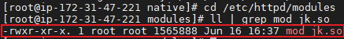

## 7. Project 세팅

Tomcat을 설치하기전에 Project를 먼저 세팅하겠습니다.

**SElinux를 사용하시는 분들 관련 설정이 존재하기 때문에 꼭 보시길 바랍니다!**

**Project의 경로**는 `/home/dummy/www` 이며, **소유자**는 `dummy` 입니다.

```bash
# dummy라는 User 생성
useradd dummy

# Project Directory 생성
mkdir /home/dummy/www
```

/home/centos 디렉토리에 있는 **war파일을 `/home/dummy/www`에 압축해제** 하였습니다.
> war 파일은 테스트를 위해 생성한 간단한 Spring MVC Project 입니다.

```bash
unzip /home/centos/spring-mvc-demo.war -d /home/dummy/www/
```

해당 디렉토리에 `apache`가 접근할 수 있도록 **그룹과 권한을 변경**하였습니다.

```bash
# project Directory의 그룹을 apache로 변경
chown -R dummy:apache /home/dummy/

# project Directory의 권한 변경
chmod -R 755 /home/dummy/
```

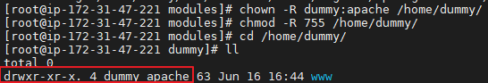

그리고 SELinux를 사용하신다면 **project Directory의 context를 변경**해 줘야 합니다.
기본적으로 SELinux에서 웹서버는 Context가 `httpd_sys_content_t type`인 **폴더 및 파일만 읽을 수** 있기 때문 입니다.

```bash
cd /home/dummy

# SElinux Context 확인
ls -Z
```

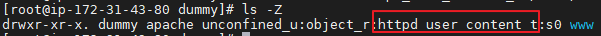

위의 사진에서 볼 수 있듯이, context가 `httpd_user_content_t`로 되어 있어서 **/home/dummy 디렉토리의 하위 디렉토리 및 파일을 모두 `httpd_sys_content_t`로 변경**하였습니다.

```bash
chcon -R -h -t httpd_sys_content_t /home/dummy/

# SElinux Context 확인
ls -Z
```

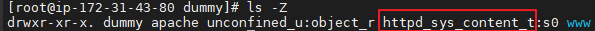

## 6. Tomcat 설치

이제 Tomcat을 설치해 보겠습니다. Tomcat를 설치하는 방법은 `다운로드`와 `패키지 설치`와 방법이 있는데, 해당 포스팅에서는 **다운로드로 진행**하였습니다.

`/usr/local/tomcat` 디렉토리에 Tomcat을 다운로드 합니다.

```bash
wget http://mirror.navercorp.com/apache/tomcat/tomcat-9/v9.0.36/bin/apache-tomcat-9.0.36.tar.gz -P /usr/local/tomcat
```

> 만약 다운로드가 안되신다면 <https://https://tomcat.apache.org/download-90.cgi>에 가셔서 아래 사진의 tar.gz에 URL로 다운로드 하시면 됩니다.

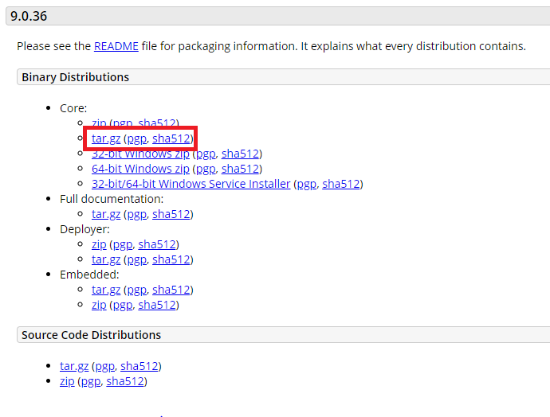

다운로드 받은 Tomcat을 `/home/dummy`에 **압축해제** 합니다.

```bash
# Tomcat 압축해제
tar -xvf /usr/local/tomcat/apache-tomcat-9.0.36.tar.gz -C /home/dummy

# 편의를 위해 이름 변경
mv /home/dummy/apache-tomcat-9.0.36/ /home/dummy/tomcat
```

그리고 Tomcat을 해당 User인 `dummy의 계정으로 실행`시키기 위해 **소유자와 그룹을 변경**합니다.

```bash
cd /home/dummy

chown -R dummy:dummy tomcat/
```

## 7. Apache Tomcat 연동

이제 Apache와 Tomcat을 연동해 보겠습니다.

### 7-1. workers.properties

Apache와 연동할 **Tomcat 목록 및 설정** 파일 입니다.

```bash
vi /etc/httpd/conf/workers.properties
```

* worker.list는 **연동할 Tomcat 목록**이며, worker.list에 정의한 이름이 **worker 이름**이 됩니다.
  * worker가 여러개 일시 `,` 를 사용해서 나열할 수 있습니다.
* worker.worker이름.port는 Tomcat과 통신할 때 사용하는 **AJP 포트번호** 입니다.
* worker.worker이름.host는 **Tomcat의 host**로 저는 한 서버에 같이 있으므로 127.0.0.1 사용하였습니다.
* worker.worker이름.type는 **프로토콜의 type**으로 현재 **ajp version 13**이 사용됩니다.
* worker.worker이름.secert는 **Tomcat과 통신시 secret이 일치해야 통신** 할 수 있습니다. 해당 설정을 사용하지 않으려면, Tomcat의 conf/server.xml에 AJP Connector 설정에 `requiredSecret="false"`를 주시면 됩니다.
* worker.worker이름.lbfactor는 **부하분산지수**와 관련된 설정으로 1로 설정시 모든 Tomcat 인스턴스에 균등하게 분산합니다.

이 외에 많은 설정이 존재하지만 아래와 같이 설정을 진행하겠습니다.

```bash
worker.list=dummy

worker.dummy.port=18009
worker.dummy.host=127.0.0.1
worker.dummy.type=ajp13
worker.dummy.secret=dummySecert
worker.dummy.lbfactor=1
```

### 7-2. httpd.conf

Apache 설정 파일로 **mod_jk 모듈 및 가상 호스트 설정 파일을 설정**해 줍니다.

```bash
vi /etc/httpd/conf/httpd.conf
```

* `Include conf/httpd-vhosts.conf`는 **가상 호스트 설정 파일을 로드** 합니다.
* `LoadModule jk_module modules/mod_jk.so`는 **mod_jk.so 모듈을 로드** 합니다.
* `<IfModule></IfModule>`은 **해당 모듈이 포함된 경우에 안에 든 지시어를 실행**하므로, jk_module 모듈이 존재시 안에 지시어가 실행됩니다.
  * `JkWorkersFile` 는 위에서 설정한 worker 파일을 지정합니다.
  * `JkShmFile`는 **공유 메모리파일 위치** 반드시 Selinux 보안때문에 run에 위치 필수 입니다.
  * `JkLogFile`는 **mod_jk 로그 파일의 위치**를 지정합니다.
  * `JkLogLevel`는 **mod_jk의 로그 레벨**을 설정합니다.
  * `JkLogStampFormat`는 **mod_jk의 로그 포맷**을 설정합니다.
* `<Directory></Directory>`는 **Project가 위치하는 경로**이며, `httpd-vhosts.conf`에 정의하는 **DocumentRoot**와 일치해야 합니다. 또한 모든 Request에 대해 액세스 할 수 있게 `Require all granted` 를 설정하였습니다.

```bash
Include conf/httpd-vhosts.conf
LoadModule jk_module modules/mod_jk.so
<IfModule jk_module>
        JkWorkersFile conf/workers.properties
        JkShmFile run/mod_jk.shm
        JkLogFile logs/mod_jk.log
        JkLogLevel info
        JkLogStampFormat "[%a %b %d %H:%M:%S %Y]"
</IfModule>

<Directory "/home/dummy/www">
    Require all granted
</Directory>

```

### 7-3. uriworkermap.properties

해당 파일은 **어떤 URI를 Tomcat**이 처리할 지 지정하는 설정 파일입니다.

```bash
vi /etc/httpd/conf/uriworkermap.properties
```

`.do`로 들어오는 URI는 모두 **workers.properties에 설정한 dummy**로 Request를 넘겨주며, **.png, .jpg로 들어오는 Request는 Apache에서 처리**하도록 하였습니다.

```bash
/*.do=dummy
!/*.png=dummy
!/*.jpg=dummy
```

> 만약 Tomcat으로 모든 요청을 넘기고 싶다면 `/*=worker이름`을 사용하시면 됩니다.

### 7-4. httpd-vhosts.conf

가상호스트를 설정하는 설정 파일로, **httpd.conf 파일에 include** 되어 있습니다.

```bash
vi /etc/httpd/conf/httpd-vhosts.conf
```

* DocumentRoot는 **Project의 Directory를 지정**하는 지시자 입니다.
* ServerName은 **Request에 있는 Host Header를 참조하여 ServerName과 일치하는 블록의 설정을 사용**합니다. 서버의 전체 주소 도메인 네임을 적어주는 것이 좋습니다.
* ServerAlias를 **추가적인 별칭을 지정**할 수 있습니다.
* JkMountFile파일은 **어떤 URI를 Apache에서 처리하고, Tomcat으로 넘길지 설정한 파일을 지정 지시자**로, 위에 `uriworkermap.properties`에 해당 설정을 정의하여서 해당 설정 파일을 지정하였습니다. 만약 File이 아닌 설정을 바로 명시하고 싶다면 ``JkMount`` 속성을 사용해서 바로 지정할 수 있습니다.

> 클라이언트가 Host 헤더를 주면, 목록에서 첫번째로 ServerName이나 ServerAlias가 대응하는 가상호스트가 요청을 서비스한다. 

```bash
<VirtualHost *:80>
        DocumentRoot "/home/dummy/www"
        ServerName ec2-3-34-166-204.ap-northeast-2.compute.amazonaws.com
        ServerAlias ec2-3-34-166-204.ap-northeast-2.compute.amazonaws.com
        JkMountFile "/etc/httpd/conf/uriworkermap.properties"

        LogLevel warn
        ErrorLog logs/dummy/ec2-3-34-166-204.ap-northeast-2.compute.amazonaws.com_error_log
        TransferLog logs/dummy/ec2-3-34-166-204.ap-northeast-2.compute.amazonaws.com_access_log
</VirtualHost>

```

### 7-5. LOG 파일 생성

위에 ``httpd-vhosts.conf``에 설정한 `ErrorLog와 TransferLog`의 경로 및 파일이 자동으로 생성되지 않으므로 **수동으로 생성**해 줘야 합니다.

```bash
mkdir /etc/httpd/logs/dummy
touch /etc/httpd/logs/dummy/ec2-3-34-166-204.ap-northeast-2.compute.amazonaws.com_error_log
touch /etc/httpd/logs/dummy/ec2-3-34-166-204.ap-northeast-2.compute.amazonaws.com_access_log
```

### 7-6. Apache 문법 검사

Apache 설정에 잘못된 문법이 존재하는지 확인합니다.

```bash
apachectl configtest
```

### 7-6. Tomcat 설정

이제 Tomcat 설정 파일을 수정해 줍니다.

수정하기 전에 `dummy`계정으로 Tomcat을 관리하므로 dummy 계정으로 로그인 후 진행합니다.

```bash
su - dummy

vi /home/dummy/tomcat/conf/server.xml
```

* AJP 포트를 사용해서 통신할 것이기 때문에 8080 포트를 사용하는 Connector은 주석처리 하였습니다.
* AJP 포트를 사용하는 Connector를 추가하였습니다.
  * protocol AJP protocol을 설정하는 부분으로 `/etc/httpd/conf/workers.properties`에 `worker.dummy.type`에 **ajp13**으로 정의 하였기 때문에 `AJP/1.3`으로 지정하였습니다.
  * address
  * port는 AJP port를 설정하는 부분으로 `/etc/httpd/conf/workers.properties`에 `worker.dummy.port`에 **18009**으로 정의 하였기 때문에 **18009**로 지정하였습니다.
  * secret는 Apache와 Tomcat이 통신할 때 **해당 Key가 일치해야 통신**하며, 해당 key는 `/etc/httpd/conf/workers.properties`에  `worker.dummy.secret`에 정의되어 있습니다. 만약 secret을 사용하지 않는다면 `secretRequired` 속성의 값을 **false**로 주시면 됩니다.
  * URIEncoding="UTF-8"은 URI의 파라미터로 한글이 들어올 때 깨지는 것을 막기위해 설정 하였습니다.
* Context를 사용해서 pro

```bash
<Connector protocol="AJP/1.3"
               address="0.0.0.0"
               port="18009"
	       secretRequired="true"
               secret="dummySecert"
               URIEncoding="UTF-8" />

<!-- 8080 Connector는 주석 처리-->
<!-- <Connector port="8080" protocol="HTTP/1.1"
               connectionTimeout="20000"
               redirectPort="8443" />-->

<Context docBase="/home/dummy/www" path="/" reloadable="false">
</Context>
```

만약 SELinux를 사용하신다면, **apache(httpd)가 연결할 수 있는 port가 제한**되어 있기 때문에, 지정한 AJP 포트는 허용해주셔야 합니다. 현재 apache(httpd)에서 사용할 수 있는 포트는 **80, 81, 443, 488, 8008,8009, 8443, 9000**이므로 지정한 AJP 포트인 18009로는 연결을 할 수가 없습니다.

```bash
su - root

semanage port -l | grep http_port_t
```


위에서 설정한 AJP 포트인 18009를 사용할 수 없기 때문에 **Permission denied이 발생**합니다.

> 해당 domain이 대한 apache 로그는 `/etc/httpd/conf/httpd-vhosts.conf`에 정의한 ErrorLog에서 확인할 수 있습니다.

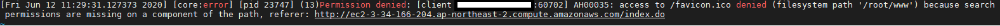

SELinux에 해당 context에 AJP 포트를 추가합니다.

```bash
semanage port -a -t http_port_t -p tcp 18009
```

apache(httpd)가 사용할 수 있는 포트를 확인해 보면, 추가한 포트가 적용된 것을 알 수있습니다.

이제부터 18009 포트를 apache(httpd)가 사용할 수 있기 때문에 Tomcat과 정상적으로 통신할 수 있습니다.

```bash
semanage port -l | grep http_port_t
```

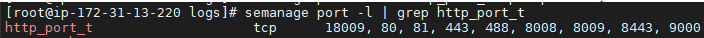

Apache를 재시작 합니다.

```bash
service httpd restart
```

Tomcat을 시작 합니다.

```bash
su - dummy
/home/dummy/tomcat/bin/./startup.sh
```

`/index.do`로 Request시 아래 RestController에 정의한 Success가 정상적으로 출력되는 것을 알 수 있습니다.**Success**

```java
@RestController
public class DemoController {

    @RequestMapping("/index.do")
    public String index(){
        return "Success";
    }
}
```

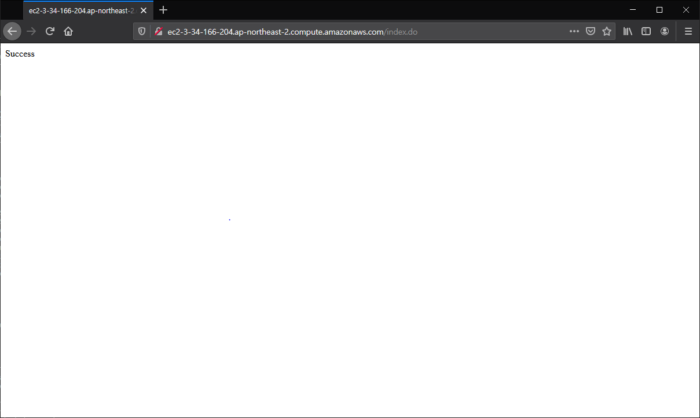

그리고 `.jpg와 .png`는 **Tomcat이 아닌 Apache에서 처리하도록 설정**하였기 때문에 테스트를 위해 Tomcat을 종료한 뒤 `/1.jpg`로 요청시 이미지가 정상적으로 나타나므로 설정이 정상적으로 된 것을 알 수 있습니다.

```bash
/home/dummy/tomcat/bin/./shutdown.sh
```

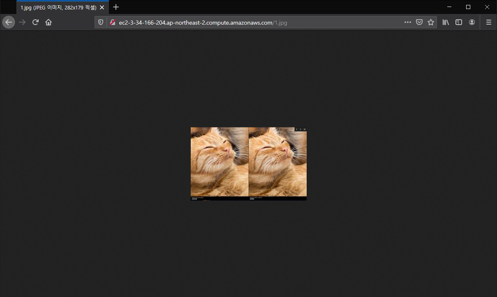