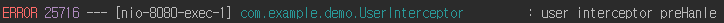

# Interceptor에서 preHandle 메소드 return 값의 의미는 무엇일까?

## 개발환경
 - JDK 1.8
 - SpringBoot 2.2.4.RELEASE

> 예제코드는 [github](https://github.com/hongji3354/blog-code/tree/master/Spring/Spring%20Boot/springboot-interceptor-preHandle) 에  있습니다.

Interceptor를 구현하기 위해 HandlerInterceptor를 상속받으면 preHandle, postHandle, afterCompletion 3개의 메소드를 오버라이드 합니다.  그 중 ``preHandle는 다른 2개의 메소드와 다르게 Boolean인 return 값을 가지고 있습니다.`` 그렇다면 true/false에 따라 동작방식이 다르다는 것인데, 무엇이 다른지 확인해 보겠습니다.

## 예제 코드

### 1. Interceptor 생성

```
@Component
@Slf4j
public class UserInterceptor implements HandlerInterceptor {

    @Override
    public boolean preHandle(HttpServletRequest request, HttpServletResponse response, Object handler) throws Exception {
        log.error("user interceptor preHanle");
        return true;
    }

    @Override
    public void postHandle(HttpServletRequest request, HttpServletResponse response, Object handler, ModelAndView modelAndView) throws Exception {
        log.error("user interceptor postHandle");
    }

    @Override
    public void afterCompletion(HttpServletRequest request, HttpServletResponse response, Object handler, Exception ex) throws Exception {
        log.error("user interceptor afterCompletion");
    }
}
```

### 2. interceptor 등록

WebMvcConfigurer를 상속받아서 addInterceptors 메서드를 오버라이드 하여 ``/user로 들어오는 URL은 모두 userInterceptor를 거쳐가도록 설정``하였습니다.
```
@Configuration
public class WebMvcConfig implements WebMvcConfigurer {

    @Resource(name = "userInterceptor")
    private HandlerInterceptor userInterceptor;

    @Override
    public void addInterceptors(InterceptorRegistry registry) {
        registry.addInterceptor(userInterceptor)
                .addPathPatterns("/user/*");
    }
}
```

### 3. Controller

```
@RestController
@Slf4j
public class TestController {

    @GetMapping("/user/list")
    public String userList(){
        log.error("user Controller");
        return "user";
    }
}
```

## 결과

- preHandle의 return 값이 true일 경우
  - Controller로 요청이 전달되며, postHandle와 afterCompletion이 모두 실행된 것을 알 수 있습니다.


- preHandle의 return 값이 false 경우 
  - Controller로 요청이 전달되지 않은 것을 알 수 있습니다.



정리하면 ``preHandle의 return 값이 true일 경우 Controller로 요청이 전달되며, false 경우 요청이 전달되지 않는다는 것을 알 수 있습니다.``

