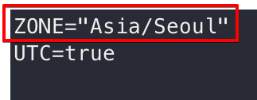
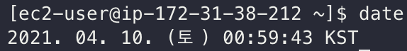

# AWS EC2 (Amzaon Linux) 시간대 KST로 변경하기

AWS EC2(Amazon Linux)의 표준 시간대는 UTC(협정 세계시)를 사용하므로, 한국 시간대인 KST로 변경해 보겠습니다.

## 1. /etc/sysconfig/clock 파일을 열어서 KST 시간대로 변경

```bash
sudo vi /etc/sysconfig/clock
```
> /etc/sysconfig/clock 파일은 root 계정 소유이므로 sudo를 사용해야 합니다.

ZONE의 값을 **Asia/Seoul**로 변경 후 저장 합니다.


> UTC 항목은 하드웨어 클록에 대한 것으로 다른 값으로 변경하시면 안됩니다.

## 2. /etc/localtime 심볼릭 링크 변경

기존 /etc/localtime에 연결된 심볼릭 링크를 제거 후 생성하기 위해 -`sf` 옵션을 사용하였습니다.

```bash
sudo ln -sf /usr/share/zoneinfo/Asia/Seoul /etc/localtime
```
> 표준 시간대 데이터 파일은 /usr/share/zoneinfo에 있습니다.

## 3. 재시작

변경사항을 적용하기 위해 인스턴스를 재시작 합니다.

```bash
sudo reboot
```

## 4. 시간대 확인

```bash
date
```

시간대가 UTC가 아닌 KST로 변경된 것을 알 수 있습니다.



## 참고

[Amazon Linux의 표준 시간대 변경](https://docs.aws.amazon.com/ko_kr/AWSEC2/latest/UserGuide/set-time.html#change_time_zone)