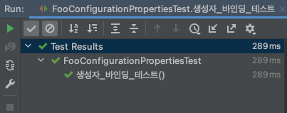

# @ConfigurationProperties 생성자 바인딩

`@ConfigurationProperties`는 기본적으로 **setter를 사용해서 바인딩을 진행**합니다.
하지만, Spring Boot 2.2 부터는 생성자를 사용해서 바인딩할 수 있습니다.

## 1. application.yml

먼저 바인딩 할 값은 application.yml에 아래와 같이 정의되어 있습니다.

```yaml
foo:
  name: foo
  age: 20
  sex: male
```

## 2. 바인딩할 클래스

application.yml에 있는 foo 값들을 생성자 바인딩 하기 위해 모든 인자를 가진 생성자를 생성해 주었으며, `@ConstructorBinding`를 사용해서 **생성자 바인딩을 사용할 것이라고 지정**해 줬습니다.

```java
@ConfigurationProperties("foo")
@ConstructorBinding
public class FooConfigurationProperties {

    private String name;
    private int age;

    public FooConfigurationProperties(String name, int age) {
        this.name = name;
        this.age = age;
    }

    public String getName() {
        return name;
    }

}
```
> Spring에 의해 생성되는 Bean(@Component, @Bean)은 생성자 바인딩을 사용할 수 없어서 @Component를 사용하지 않았습니다.

## 3. @ConfigurationProperties scanning 활성

생성자 바인딩을 사용하기 위해 `@EnableConfigurationProperties` 또는 `@ConfigurationPropertiesScan`를 사용해야 하는데
@EnableConfigurationProperties 같은 경우 클래스를 지정해 줘야 하는 불편함이 있으므로 자동으로 스캔하는 @ConfigurationPropertiesScan를 사용하였습니다.

```java
@ConfigurationPropertiesScan
@SpringBootApplication
public class Application {

    public static void main(String[] args) {
        SpringApplication.run(Application.class, args);
    }

}
```
> @ConfigurationPropertiesScan는 Spring Boot 2.2에서는 기본으로 활성화 되었으나 Spring Boot 2.2.1 부터는 선택사항으로 변경되었습니다.

## 4. 테스트

이제 값이 정상적으로 바인딩 되는지 확인해보겠습니다.

```java
@SpringBootTest
class FooConfigurationPropertiesTest {

    @Autowired
    FooConfigurationProperties fooConfigurationProperties;

    @Test
    public void 생성자_바인딩_테스트() {
        assertThat(fooConfigurationProperties.getName(), is("foo"));
        assertThat(fooConfigurationProperties.getAge(), is(20));
    }

}
```

테스트가 정상적으로 통과했으므로, 값이 정상적으로 바인딩된 것을 알 수 있습니다.



## 참고
- [Constructor binding](https://docs.spring.io/spring-boot/docs/2.4.0/reference/html/spring-boot-features.html#boot-features-external-config-constructor-binding)
- [@ConfigurationProperties scanning](https://github.com/spring-projects/spring-boot/wiki/Spring-Boot-2.2-Release-Notes#configurationproperties-scanning)

