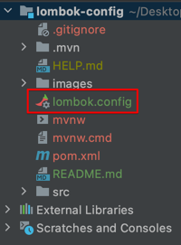
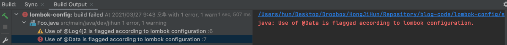

# lombok.config를 사용해서 특정 어노테이션 제한하기

만약 Code Convention으로 lombok의 특정 어노테이션을 사용하지 않는다고 할 때 **lombok.config를 활용하면 매우 편하게 적용**할 수 있습니다.

> lombok.config는 lombok 1.14에 추가되었으며 상세내용은 [Configuration system](https://projectlombok.org/features/configuration)을 확인해주세요.

## 1. 설정 파일 생성

프로젝트 최상단에 lombom 설정파일인 **lombok.config**를 생성합니다.



## 2. 규칙 작성

`lombok.{해당어노테이션}.flagUsage` 를 사용해서 해당 어노테이션 사용시 WARN을 발생시킬지 ERROR를 발생시킬지 지정할 수 있습니다.

아래 설정파일에서는 `@Log4j2` 사용시에는 Warning이 발생하며, `@Data` 사용시에는 Error가 발생합니다.

```properties
lombok.data.flagUsage = ERROR
lombok.log.log4j2.flagUsage = WARNING
```

lombok.config 설정파일에 정의한 데로  `@Log4j2` 사용한 부분은 Warning이 발생되었으며 `@Data`를 사용한 부분은 Error가 발생해서 빌드가 실패한 것을 알 수 있습니다.

