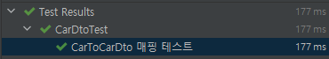

# MapStruct 정리

> 코드는 [Github](https://github.com/hongji3354/blog-code/tree/master/mapstruct-demo) 에 있습니다.

MapStruct란 **매핑정보를 기반으로 매핑코드를 생성**해서 Java Bean간의 매핑을 자동으로 해주는 라이브러리 입니다.

## 1. 환경

테스트 환경은 아래와 같습니다.

- JDK 11
- Spring Boot 2.4.1
- Gradle 6.7.1
- lombok 1.18.16
- MapStruct 1.4.1.Final

## 2. 의존성 추가

만약 lombok을 사용하신다면 아래와 같이 **의존성 순서를 꼭 지켜주셔야 합니다.**
의존성 순서를 지키지 않았을 때 lombok의 어노테이션을 MapStruct가 인식하지 못해 전혀 다른 매핑 코드가 생성될 수 있습니다.

또한 lombok 1.18.16 버전 부터는 `lombok-mapstruct-binding`를 추가해주셔야 합니다. 자세한 내용은 [Lombok Changelog](https://projectlombok.org/changelog) 를 참고해 주세요.
> 의존성 순서를 안지켰을시 lombok의 @Builder를 사용했음에도 불구하고 MapStruct의 매핑 코드에서는 Builder 패턴이 아닌 생성자를 사용했습니다.

```groovy
ext {
    mapstructVersion = "1.4.1.Final"
    lombokVersion = "1.18.16"
    lombokMapstructBindingVersion = "0.2.0"
}

dependencies {
    implementation "org.mapstruct:mapstruct:${mapstructVersion}", "org.projectlombok:lombok:${lombokVersion}"
    annotationProcessor "org.mapstruct:mapstruct-processor:${mapstructVersion}", "org.projectlombok:lombok:${lombokVersion}", "org.projectlombok:lombok-mapstruct-binding:${lombokMapstructBindingVersion}"
}
```

## 3. 컴파일 옵션 추가

매핑 정보를 정의하는 인터페이스에 componentModel = "spring" 옵션을 사용하면 **생성된 매핑코드에 @Compoent가 붙어서 Spring Bean으로 사용**할 수 있습니다.

매핑 정보를 정의하는 모든 인터페이스에 componentModel = "spring"을 붙이는 것은 귀찮은 일이므로 아래처럼 컴파일 옵션을 추가하면 해당 옵션이 자동으로 적용 됩니다. 

```groovy
compileJava {
    options.compilerArgs += [
            '-Amapstruct.defaultComponentModel=spring'
    ]
}
```

> 자세한 설정 옵션은 [MapStruct 1.4.1.Final Reference Guide](https://mapstruct.org/documentation/stable/reference/html/#configuration-options) 참고해주세요.

## 4. 매핑 예제

그럼 MapStruct를 사용해서 매핑 코드를 어떻게 생성하는지 알아보겠습니다.

### 4-1. Entity/dto 생성

Entity와 DTO 사이의 매핑코드를 자주 사용하기 때문에 Entity와 DTO를 생성합니다.

```java
@NoArgsConstructor(access = AccessLevel.PROTECTED)
@Getter
public class Car {
    @Id
    private String vehicleIdentificationNumber;
    private String manufacturer;
    private String color;
    private int numberOfSeat;

    @Builder
    public Car(String vehicleIdentificationNumber, String manufacturer, String color, int numberOfSeat) {
        this.vehicleIdentificationNumber = vehicleIdentificationNumber;
        this.manufacturer = manufacturer;
        this.color = color;
        this.numberOfSeat = numberOfSeat;
    }
}

@Getter
@Setter
@ToString
public class CarDto {
    private String manufacturer;
    private String color;
    private int numberOfSeat;
}
```

### 4-2. 매핑 정보 생성

MapStruct는 매핑 정보를 토대로 매핑 코드를 생성하기 때문에 **매핑 정보를 정의하기 위한 인터페이스를 생성**합니다.

`@Mapper` 어노테이션을 사용해서 MapStruct가 **매핑 코드 생성시 사용하는 인터페이스임을 지정**하며 메소드를 통해서 매핑 정보를 생성합니다.
아래 코드에서는 carToCarDto 메소드의 파라미터인 **Car를 CarDto로 매핑하는 매핑코드가 생성**됩니다.

```java
@Mapper
public interface CarMapper {
    CarDto carToCarDto(Car car);
}
```

### 3-3. 매핑 코드 확인

Compile을 하면 매핑 코드가 생성되며, carToCarDto 메소드의 파라미터인 Car를 CarDto로 매핑하는 매핑코드가 생성된 것을 알 수 있습니다.
또한 @Component 어노테이션이 붙여져 있기 때문에 의존주입을 받을 수 있습니다.

```java
@Generated(
    value = "org.mapstruct.ap.MappingProcessor",
    date = "2021-01-25T12:10:42+0900",
    comments = "version: 1.4.1.Final, compiler: IncrementalProcessingEnvironment from gradle-language-java-6.7.1.jar, environment: Java 11.0.9 (Oracle Corporation)"
)
@Component
public class CarMapperImpl implements CarMapper {

    @Override
    public CarDto carToCarDto(Car car) {
        if ( car == null ) {
            return null;
        }

        CarDto carDto = new CarDto();

        carDto.setManufacturer( car.getManufacturer() );
        carDto.setColor( car.getColor() );
        carDto.setNumberOfSeat( car.getNumberOfSeat() );

        return carDto;
    }
}
```

## 3-4. 테스트

매핑 코드가 정상적으로 작동하는지 테스트 해보겠습니다.

```java
@SpringBootTest
class CarDtoTest {

    @Autowired
    CarMapper carMapper;

    @DisplayName("CarToCarDto 매핑 테스트")
    @Test
    public void carToCarDto(){
        Car car = Car.builder()
                .vehicleIdentificationNumber("202001030000001")
                .manufacturer("Hyundai")
                .color("RED")
                .numberOfSeat(5)
                .build();
        CarDto carDto = carMapper.carToCarDto(car);
        assertThat(carDto.getManufacturer(),is("Hyundai"));
        assertThat(carDto.getColor(),is("RED"));
        assertThat(carDto.getNumberOfSeat(),is(5));
    }
}
```

테스트가 정상적으로 통과하는 것을 확인할 수 있습니다.



## 4. Field 명이 다를시

MapStruct는 Field 명이 일치하는 것에서만 매핑 코드를 생성합니다.
만약 Field 명이 다를 경우 @Mapping 어노테이션을 사용해서 명시적으로 지정할 수 있습니다.

@Mapping 어노테이션을 사용해서 CarDto에 있는 identificationNumber을 vehicleIdentificationNumber에 매핑 되도록 설정하였습니다.
```java
@Mapper
public interface CarMapper {

    CarDto carToCarDto(Car car);

    @Mappings(
            @Mapping(source = "identificationNumber", target = "vehicleIdentificationNumber")
    )
    Car carDtoToCar(CarDto carDto);
}
```

생성된 매핑 코드를 보면 carDto의 identificationNumber를 vehicleIdentificationNumber에 넣어주는 것을 알 수 있습니다.

```java
@Component
public class CarMapperImpl implements CarMapper {
    
    public Car carDtoToCar(CarDto carDto) {
        if (carDto == null) {
            return null;
        } else {
            CarBuilder car = Car.builder();
            car.vehicleIdentificationNumber(carDto.getIdentificationNumber());
            car.manufacturer(carDto.getManufacturer());
            car.color(carDto.getColor());
            car.numberOfSeat(carDto.getNumberOfSeat());
            return car.build();
        }
    }
}
```
> 위의 코드에서 Car Entity는 빌더 패턴이 정의되어 있기 때문에 매핑시 빌더를 사용하였습니다. MapStruct는 빌더,생성자,getter/setter 모두 지원하므로 편하신 걸 사용하시면 됩니다.

이외에도 MapStruct는 다양한 매핑 방법과 각종 설정을 지원합니다.
자세한 내용은 [MapStruct 1.4.1.Final Reference Guide](https://mapstruct.org/documentation/stable/reference/html) 를 참고해주세요.