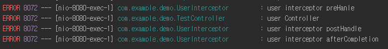

# Interceptor에서 preHandle 메소드 return 값의 의미는 무엇일까?

## 환경
 - JDK 1.8
 - SpringBoot 2.2.4.RELEASE

## preHandle의 return값이 true 일때
**Controller로 요청이 넘어가며**, Controller에서 요청을 처리하기 때문에 postHandle 메서드와 afterCompletion 메서드가 실행된다. 

## preHandle의 return값이 false 일때
**Controller로 요청이 넘어가지 않으며**, Controller로 요청이 넘어가지 않기 때문에 postHandle 메서드와 afterCompletion 메서드가 실행되지 않는다.

## 예제

### 1. Interceptor 생성
```
@Component
@Slf4j
public class UserInterceptor implements HandlerInterceptor {

    @Override
    public boolean preHandle(HttpServletRequest request, HttpServletResponse response, Object handler) throws Exception {
        log.error("user interceptor preHanle");
        return true;
    }

    @Override
    public void postHandle(HttpServletRequest request, HttpServletResponse response, Object handler, ModelAndView modelAndView) throws Exception {
        log.error("user interceptor postHandle");
    }

    @Override
    public void afterCompletion(HttpServletRequest request, HttpServletResponse response, Object handler, Exception ex) throws Exception {
        log.error("user interceptor afterCompletion");
    }
}
```

## 2. interceptor 등록
/user로 들어오는 URL은 모두 userInterceptor를 거쳐가도록 설정하였다.
```
@Configuration
public class WebMvcConfig implements WebMvcConfigurer {

    @Resource(name = "userInterceptor")
    private HandlerInterceptor userInterceptor;

    @Override
    public void addInterceptors(InterceptorRegistry registry) {
        registry.addInterceptor(userInterceptor)
                .addPathPatterns("/user/*");
    }
}
```

## 3. Controller
```
@RestController
@Slf4j
public class TestController {

    @GetMapping("/user/list")
    public String userList(){
        log.error("user Controller");
        return "user";
    }
}
```

## 결과

preHandle의 return 값이 true일 경우 preHandle -> Controller -> postHandle -> afterCompletion 순으로 실행된 것을 알 수 있다.



preHandle의 return 값이 false 경우 preHandle에서 요청이 끝난 것을 알 수 있다.


