# @Transactional propagation이란?

> 코드는 [Github]() 에 있습니다.

@Transactional propagation이란 **트랜잭션을 시작하거나 기존 트랜잭션에 참여하는 방법을 결정하는 속성** 입니다.

propagation에 올 수 있는 값으로는 `REQUIRED, SUPPORTS, MANDATORY, REQUIRES_NEW, NOT_SUPPORTED, NEVER, NESTED` 가 있습니다.

## 1. 환경

테스트 환경은 아래와 같습니다.

- JDK 11
- Spring Boot 2.4.2
- Gradle 6.7.1

## 2. REQUIRED

Default 속성이며 모든 Transaction Management가 지원합니다.

미리 시작된 트랜잭션이 있으면 같은 트랜잭션으로 묶이며 없으면 새로 시작합니다.

### 2-1. 부모 REQUIRED, 자식 REQUIRED 시

parentTransactionRequired 메소드에서 이미 시작된 트랜잭션이 있기 때문에 childTransactionRequired 메소드의 트랜잭션은 parentTransactionRequired 메소드에서 이미 시작된 트랜잭션과 병합됩니다.

```java
@Slf4j
@RequiredArgsConstructor
@Service
public class FooParentService {

    private final FooChildService fooChildService;

    @Transactional(propagation = Propagation.REQUIRED)
    public void parentTransactionRequired(){
        log.info("parent current transaction : {}", TransactionSynchronizationManager.getCurrentTransactionName());
        fooChildService.childTransactionRequired();
    }
}

@Slf4j
@Service
public class FooChildService {

    @Transactional(propagation = Propagation.REQUIRED)
    public void childTransactionRequired(){
        log.info("child current transaction : {}", TransactionSynchronizationManager.getCurrentTransactionName());
    }
}
```

트랜잭션이 병합되어 동일한 트랜잭션 이름이 출력 됩니다.

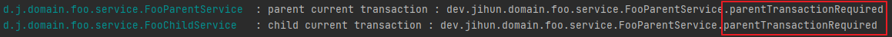

### 2-2. 부모 non-transaction, 자식 REQUIRED 시

parentTransactionRequired 메소드에서 시작된 트랜잭션이 없기 때문에 childTransactionRequired 메소드는 새로운 트랜잭션을 시작합니다.

```java
@Slf4j
@RequiredArgsConstructor
@Service
public class FooParentService {

    private final FooChildService fooChildService;

    public void parentNonTransaction(){
        log.info("parent current transaction : {}", TransactionSynchronizationManager.getCurrentTransactionName());
        fooChildService.childTransactionRequired();
    }
}

@Slf4j
@Service
public class FooChildService {

    @Transactional(propagation = Propagation.REQUIRED)
    public void childTransactionRequired(){
        log.info("child current transaction : {}", TransactionSynchronizationManager.getCurrentTransactionName());
    }
}
```

parentNonTransaction 메소드는 트랜잭션이 없기 때문에 null이 출력되며, childTransactionRequired 메소드는 트랜잭션을 새로 시작하기 때문에 자신의 이름이 출력됩니다.

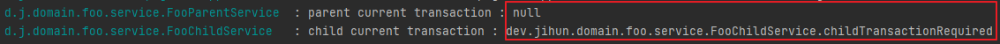

## 3. SUPPORTS

이미 시작된 트랜잭션이 있으면 참여하며, 그렇지 않으면 트랜잭션 없이 진행합니다.

### 3-1. 부모 REQUIRED, 자식 SUPPORTS 시

parentTransactionRequired 메소드에서 이미 시작된 트랜잭션이 있기 때문에 childTransactionRequired 메소드의 트랜잭션은 parentTransactionRequired 메소드에서 이미 시작된 트랜잭션과 병합됩니다.

```java
@Slf4j
@RequiredArgsConstructor
@Service
public class FooParentService {

    private final FooChildService fooChildService;

    @Transactional(propagation = Propagation.REQUIRED)
    public void parentTransactionRequired(){
        log.info("parent current transaction : {}", TransactionSynchronizationManager.getCurrentTransactionName());
        fooChildService.childTransactionSupports();
    }
}

@Slf4j
@RequiredArgsConstructor
@Service
public class FooChildService {

    @Transactional(propagation = Propagation.SUPPORTS)
    public void childTransactionSupports(){
        log.info("child current transaction : {}", TransactionSynchronizationManager.getCurrentTransactionName());
    }
}
```

트랜잭션이 병합되어 동일한 트랜잭션 이름이 출력 됩니다.

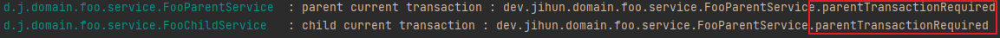

### 3-2. 부모 non-transaction, 자식 SUPPORTS 시

parentTransactionRequired 메소드에서 시작된 트랜잭션이 없기 때문에 childTransactionRequired 메소드의 트랜잭션은 생성되지 않습니다.

```java
@Slf4j
@RequiredArgsConstructor
@Service
public class FooParentService {

    private final FooChildService fooChildService;

    public void parentNonTransaction(){
        log.info("parent current transaction : {}", TransactionSynchronizationManager.getCurrentTransactionName());
        fooChildService.childTransactionSupports();
    }
}

@Slf4j
@Service
public class FooChildService {

    @PersistenceContext
    EntityManager entityManager;

    @Transactional(propagation = Propagation.SUPPORTS)
    public void childTransactionSupports(){
        log.info("child current transaction : {}", TransactionSynchronizationManager.getCurrentTransactionName());
        entityManager.persist(Foo.builder().id("child").build());
    }
}
```

시작된 트랜잭션도 없으며, childTransactionSupports 메소드에서도 트랜잭션을 만들지 않기 때문에 persist시 오류가 발생합니다.

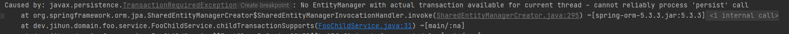

> JpaRepository 대신 entityManager를 사용한 이유는 JpaRepository의 각 메서드에 @Transactional이 적용되어 있기 때문에 올바른 결과를 얻을 수 없기 때문입니다.

## 4. MANDATORY

이미 시작된 트랜잭션이 있으면 참여하며, 없으면 새로 예외를 발생시킵니다.

SUPPORTS와 유사하지만, SUPPORTS는 트랜잭션이 시작된 것이 없으면 트랜잭션 없이 진행하는 것이 차이점 입니다.

### 4-1. 부모 REQUIRED, 자식 MANDATORY 시

이미 시작된 트랜잭션이 있기 때문에 기존 트랜잭션과 병합됩니다.

```java
@Slf4j
@RequiredArgsConstructor
@Service
public class FooParentService {

    private final FooChildService fooChildService;

    @Transactional(propagation = Propagation.REQUIRED)
    public void parentTransactionRequired(){
        log.info("parent current transaction : {}", TransactionSynchronizationManager.getCurrentTransactionName());
        fooChildService.childTransactionMandatory();
    }
}

@Slf4j
@Service
public class FooChildService {

    @Transactional(propagation = Propagation.MANDATORY)
    public void childTransactionMandatory(){
        log.info("child current transaction : {}", TransactionSynchronizationManager.getCurrentTransactionName());
    }
}
```

기존 트랜잭션과 병합되어 동일한 이름이 출력 됩니다.

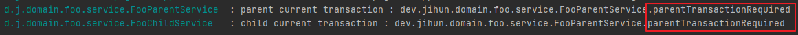

### 4-2. 부모 non-transaction, 자식 MANDATORY 시

이미 시작된 트랜잭션이 없기 때문에 예외가 발생합니다.

```java
@Slf4j
@RequiredArgsConstructor
@Service
public class FooParentService {

    private final FooChildService fooChildService;

    public void parentNonTransaction(){
        log.info("parent current transaction : {}", TransactionSynchronizationManager.getCurrentTransactionName());
        fooChildService.childTransactionMandatory();
    }
}

@Slf4j
@Service
public class FooChildService {

    @Transactional(propagation = Propagation.MANDATORY)
    public void childTransactionMandatory(){
        log.info("child current transaction : {}", TransactionSynchronizationManager.getCurrentTransactionName());
    }
}
```

시작된 트랜잭션이 없어서 예외가 발생하였습니다.

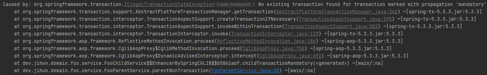

## 5. REQUIRES_NEW

항상 새로운 트랜잭션을 시작 합니다.

### 5-1. 부모 REQUIRED, 자식 REQUIRES_NEW 시

이미 트랜잭션이 존재해도 새로운 트랜잭션을 생성 합니다.

```java
@Slf4j
@RequiredArgsConstructor
@Service
public class FooParentService {

    private final FooChildService fooChildService;

    @Transactional(propagation = Propagation.REQUIRED)
    public void parentTransactionRequired(){
        log.info("parent current transaction : {}", TransactionSynchronizationManager.getCurrentTransactionName());
        fooChildService.childTransactionRequiresNew();
    }
}

@Slf4j
@Service
public class FooChildService {

    @Transactional(propagation = Propagation.REQUIRES_NEW)
    public void childTransactionRequiresNew(){
        log.info("child current transaction : {}", TransactionSynchronizationManager.getCurrentTransactionName());
    }
}
```

서로 다른 트랜잭션 이름이 출력됩니다.

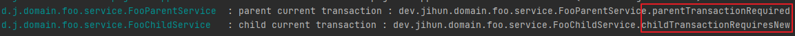

### 5-2. 부모 non-transaction, 자식 REQUIRES_NEW 시

트랜잭션이 없어도 새로운 트랜잭션을 생성 합니다.

```java
@Slf4j
@Service
public class FooParentService {

    private final FooChildService fooChildService;

    public void parentNonTransaction(){
        log.info("parent current transaction : {}", TransactionSynchronizationManager.getCurrentTransactionName());
        fooChildService.childTransactionRequiresNew();
    }
}

@Slf4j
@Service
public class FooChildService {

    @Transactional(propagation = Propagation.REQUIRES_NEW)
    public void childTransactionRequiresNew(){
        log.info("child current transaction : {}", TransactionSynchronizationManager.getCurrentTransactionName());
    }
}
```

parentNonTransaction 메소드의 트랜잭션 이름은 null 이지만, childTransactionRequiresNew 메소드는 새로운 트랜잭션을 시작하여 이름이 출력됩니다.

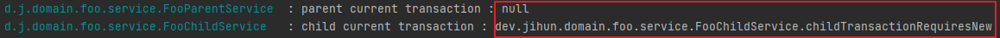

## 6. NOT_SUPPORTED

트랜잭션을 사용하지 않습니다. 이미 진행 중인 트랜잭션이 있다면 보류시킵니다.

### 6-1. 부모 REQUIRED, 자식 NOT_SUPPORTED 시

parentTransactionRequired 메소드에서 트랜잭션을 시작하지만 childTransactionNotSupported 메소드에서 트랜잭션을 보류시킵니다.

```java
@Slf4j
@RequiredArgsConstructor
@Service
public class FooParentService {

    private final FooChildService fooChildService;

    @Transactional(propagation = Propagation.REQUIRED)
    public void parentTransactionRequired(){
        log.info("parent current transaction : {}", TransactionSynchronizationManager.getCurrentTransactionName());
        fooChildService.childTransactionNotSupported();
    }
}

@Slf4j
@Service
public class FooChildService {

    @PersistenceContext
    EntityManager entityManager;

    @Transactional(propagation = Propagation.NOT_SUPPORTED)
    public void childTransactionNotSupported(){
        log.info("child current transaction : {}", TransactionSynchronizationManager.getCurrentTransactionName());
        entityManager.persist(Foo.builder().id("child").build());
    }
}
```

parentTransactionRequired 메소드에서 트랜잭션을 시작하지만 childTransactionNotSupported 메소드에서 트랜잭션을 보류시키기 때문에 persist시 오류가 발생합니다.

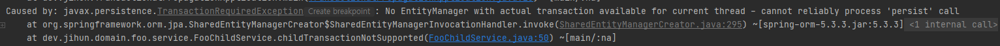

## 7. NEVER

트랜잭션을 사용하지 않도록 강제합니다.

만약 진행 중인 트랜잭션이 존재시 예외를 발생시킵니다.

### 7-1. 부모 REQUIRED, 자식 NEVER

parentTransactionRequired 메소드에서 트랜잭션을 시작하기 때문에 예외를 발생시킵니다.

```java
@Slf4j
@RequiredArgsConstructor
@Service
public class FooParentService {

    private final FooChildService fooChildService;

    @Transactional(propagation = Propagation.REQUIRED)
    public void parentTransactionRequired(){
        log.info("parent current transaction : {}", TransactionSynchronizationManager.getCurrentTransactionName());
        fooChildService.childTransactionNever();
    }
}

@Slf4j
@Service
public class FooChildService {

    @Transactional(propagation = Propagation.NEVER)
    public void childTransactionNever(){
        log.info("child current transaction : {}", TransactionSynchronizationManager.getCurrentTransactionName());
    }
}
```

이미 진행중인 트랜잭션이 있어서 예외가 발생했습니다.

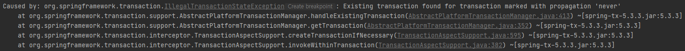

## 8. NESTED

이미 진행 중인 트랜잭션이 있으면 해당 트랜잭션 안에 트랜잭션을 생성 합니다.

이렇게 중첩된 트랜잭션은 부모 트랜잭션의 커밋과 롤백에는 영향을 받지만 자신의 커밋과 롤백은 부모 트랜잭션에게 영향을 주지 않습니다.w

중첩 트랜잭션은 JDBC 3.0 스펙의 저장포인트(savepoint)를 지원하는 드라이버와 DataSourceTransactionManager를 이용할 경우에 적용 가능 합니다.

Spring Boot + Spring Data JPA 사용시 TransactionManager는 JpaTransactionManager를 사용하기 때문에 nested 미지원하며 그로 인해 아래와 같은 예외가 발생합니다.

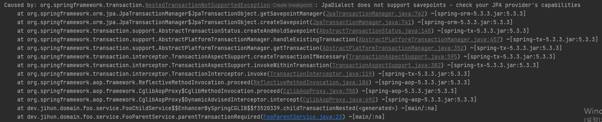
